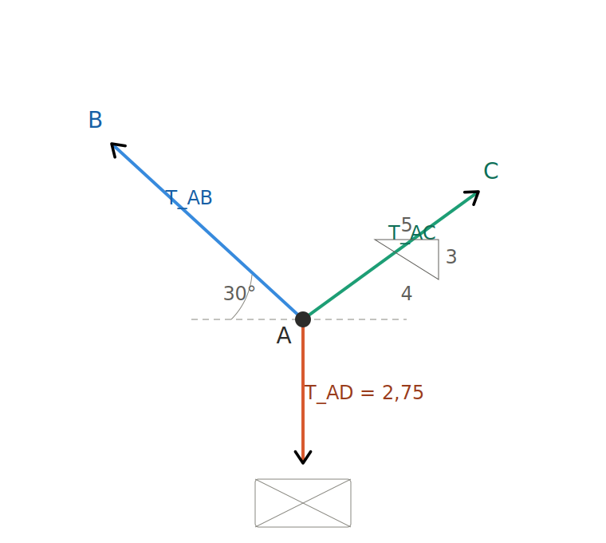

# Questão 6 — Forças nos cabos (equilíbrio do ponto A)

**Enunciado:** A caixa possui peso de 2,75 kN. Se o sistema está em equilíbrio, determine as forças atuando em cada cabo.

---

## 1. DCL do ponto A

Ponto A com três cabos:
- **AB** → sobe para a esquerda, 30° com a horizontal
- **AC** → sobe para a direita, triângulo 3-4-5
- **AD** → desce, sustentando a caixa

## 2. Componentes

- AB → cos30° = 0,866 (x) · sen30° = 0,5 (y)
- AC → 4/5 = 0,8 (x) · 3/5 = 0,6 (y)
- AD → 2,75 kN (para baixo)

## 3. Equilíbrio

$$T_{AD} = 2,75 \text{ kN}$$

$$\sum F_x = 0: \quad -0,866\,T_{AB} + 0,8\,T_{AC} = 0 \;\Rightarrow\; T_{AC} = 1,083\,T_{AB}$$

$$\sum F_y = 0: \quad 0,5\,T_{AB} + 0,6\,T_{AC} = 2,75$$

## 4. Substituindo

$$0,5\,T_{AB} + 0,6(1,083\,T_{AB}) = 2,75 \;\Rightarrow\; T_{AB} = 2,39 \text{ kN}$$

## 5. Resultados

$$T_{AB} = 2,39 \text{ kN} \qquad T_{AC} = 2,59 \text{ kN} \qquad T_{AD} = 2,75 \text{ kN}$$

---

