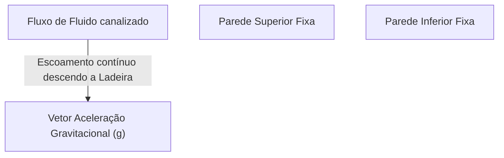

# SIMULADO DE HIDRODINÂMICA

## Instruções

- **Quantidade de questões:** 40 questões variadas (verdadeiro/falso, múltipla escolha, interpretação e discursivas).
- **Tempo sugerido:** 2 horas e 30 minutos.
- **Foco principal:** Interpretação física dos fenômenos e interpretação das equações analíticas, buscando a lógica mecânica e não a simples memorização. 
- **Justificativas:** Quando solicitado, a justificativa é parte inseparável da resposta, e nela o foco deve residir nos princípios físicos regentes.
- **Consultas:** O simulado deve ser realizado com os próprios conhecimentos internalizados sobre os Resumos da disciplina.

---

# PARTE I — QUESTÕES CONCEITUAIS

**Questão 1:**
(Verdadeiro ou Falso) Em um escoamento considerado incompressível, a densidade da partícula fluida é tida como constante ($\rho = const.$), reduzindo a equação geral da continuidade para a forma $\nabla \cdot \mathbf{V} = 0$. Esse resultado indica fisicamente que, nesse caso, a velocidade local em qualquer direção (x, y ou z) está proibida de variar no espaço (ex: $\frac{\partial u}{\partial x}$ deve obrigatoriamente ser zero). Justifique.

### Gabarito Comentado
**Resposta:** Falso.
**Conceito:** Conservação da Massa (Continuidade) para Escoamento Incompressível.
**Justificativa:**
A expressão incompressível $\nabla \cdot \mathbf{V} = 0$ expande-se para $\frac{\partial u}{\partial x} + \frac{\partial v}{\partial y} + \frac{\partial w}{\partial z} = 0$. Fisicamente, isso significa que a velocidade local nas direções pode sim variar no espaço (por exemplo, existir uma aceleração direcional $\partial u/\partial x \neq 0$ em um tubo convergente). O que a restrição incompressível impõe é que a soma algébrica dessas três variações dimensionais deve obrigatoriamente se anular (o volume de fluido que se estica em uma direção deve encolher nas outras) para manter o volume confinado da partícula fluido intacto e, consequentemente, a sua densidade constante perante a continuidade fechada.
**Fonte:** Capítulo 1 - Conservação da Massa / Equação da Continuidade.

**Questão 2:**
Associe corretamente as abordagens de observação (I — Lagrangeana, II — Euleriana) com as suas respectivas características:
(a) Avalia variações do escoamento posicionando uma "janela" fixa no espaço.
(b) Exige o registro das grandezas movendo-se junto e acompanhando a partícula fluida ao longo da trajetória.
(c) Quando sob efeito de escoamento permanente, a derivada da velocidade local em relação ao tempo é zero ($\frac{\partial u}{\partial t} = 0$).
(d) É considerada mais intuitiva e escolar para registrar a Segunda Lei de Newton (MUV e descidas sem atrito).

### Gabarito Comentado
**Resposta:** (a) II; (b) I; (c) II; (d) I.
**Conceito:** Descrições Lagrangeana e Euleriana.
**Justificativa:**
A abordagem Lagrangeana foca na partícula isolada transitando fluidamente pelo cenário (como observar e mover-se junto a um carro na pista), sendo o padrão mais direto para aplicar as leis inerciais de Newton em massa de controle estrita. Já a abordagem Euleriana "crava a vista" em uma janela fixa euleriana (Volume de Controle) por onde as faixas de material escoam perenemente ao longo do tempo. Se o regime é permanente nessa "janela", a leitura do relógio estacionário no mesmo ponto não altera os valores marcados na escala ($\frac{\partial u}{\partial t} = 0$).
**Fonte:** Capítulo 1 - Abordagens de Observação de Escoamentos.

**Questão 3:**
Sobre a classificação e a natureza das forças atuantes em um elemento infinitesimal de fluido (volume de controle), qual das afirmações abaixo está **INCORRETA**?
(A) As forças de pressão são categorizadas como normais por atuarem de modo perpendicular às superfícies geométricas da fronteira.
(B) A existência de uma força tangencial viscosa efetiva pressupõe obrigatoriamente a presença de um gradiente espacial de velocidade entre camadas vizinhas do fluido.
(C) Para que haja aceleração direcional (translação), uma partícula fluida pode estar submetida a tensões de cisalhamento idênticas em suas faces superior e inferior, sendo a diferença entre elas irrelevante para a translação.
(D) As forças de gravidade classificam-se como forças de corpo, atuando homogeneamente ao longo de todo o volume sem a necessidade de toque superficial físico.

### Gabarito Comentado
**Resposta:** C.
**Conceito:** Forças de Superfície e Tensões Viscosas em Volumes de Controle.
**Justificativa:**
No balanço representativo de forças em um bloco fluido (Volume de Controle 2D), a submissão exata de tensões rastejantes rigorosamente idênticas no chão e no topo acarreta unicamente no esgarçamento e esmagamento torcional da partícula perante seu centro rotatório engaiolado. Sem existir uma diferença (gradiente) líquida entre as tensões nas faces superior e inferior, não sobra nenhum saldo tracional líquido isolado resultante ("braço motriz direcional isolado") capaz de promover translação frontal acelerada daquela massa isolada.
**Análise das alternativas:**
- **A)** Correta. A pressão age perpendicularmente às fronteiras exercendo compressões normais diretas.
- **B)** Correta. O arrasto tangencial depende da lei de Newton $\tau = \mu \frac{\partial u}{\partial y}$, existindo apenas se o gradiente relativo entre camadas for não-nulo.
- **C)** **Incorreta**. Tensões idênticas opostas anulam seus efeitos direcionais longitudinais, impedindo saldo líquido para impor arrasto translatório livre; logo, a diferença entre elas é estritamente essencial.
- **D)** Correta. A atração gravitacional compõe as forças massivas de corpo atuantes por atração, prescindindo da interface material de contato exigida por tensões da superfície.
**Fonte:** Capítulo 2 - Forças Viscosas e Tensões sobre o Volume de Controle.

**Questão 4:**
A literatura analítica para dutos requer o estabelecimento prévio de severas hipóteses (como o escoamento "totalmente desenvolvido"). Por que motivo essa hipótese estrutural restritiva NÃO se aplica à hidrodinâmica clássica do escoamento externo sobre o casco de um navio e seus apêndices em mar aberto?

(A) Porque navios navegam predominantemente em oceanos onde o fluido invariavelmente rompe o caráter de escoamento incompressível devido à profundidade.
(B) Porque, por não estar trancado em um contorno confinado longo (canal fechado), as linhas de fluxo marinhas convergem e divergem ao longo de sua morfologia complexa, impedindo que o campo adote uma geometria estática invariante na direção motriz.
(C) Porque o casco de aço interage magneticamente com a água, incluindo forças de corpo não lineares que vetam o desenvolvimento irrotacional integral.
(D) Porque, devido ao efeito Squat, a água deve ser tratada como fluido puramente não-newtoniano perto da proa, o que impede que os fluxos se "desenvolvam" a ré.

### Gabarito Comentado
**Resposta:** B.
**Conceito:** Escoamento Totalmente Desenvolvido versus Escoamento Externo.
**Justificativa:**
O jargão modelador "totalmente desenvolvido" condena estritamente as águas a se perfilarem cimentadas e inalteradas nos transcursos exatos longitudinais paralelos e infinitos de condutos fechados (exigindo premissas de fronteiras simétricas contínuas $\frac{\partial u}{\partial x} = 0$). Essa premissa é flagrantemente incorreta e falsa para campos marinhos complexos nas bacias livres em volta do navio aberto, onde lemes, proas e costados morfologicamente curvos reconfiguram permanentemente as passagens das águas convergentes e divergentes, o que veta terminantemente que elas estabilizem em trajetórias eulerianas perenes e isoladas de modo restrito a um perfil estagnado unidimensional.
**Análise das alternativas:**
- **A)** Incorreta. Tratamentos oceânicos para cascos em superfície mantêm a hipótese incompressível inviolada.
- **B)** **Correta**. Traduz com precisão o rompimento físico e estrutural macroscópico causado pelas formas das carenas navais que não engaiolam perfis de fluxos lineares longos uniformes.
- **C)** Incorreta. Hidrodinâmica convencional ignora quaisquer premissas impositivas magnéticas navais no corpo.
- **D)** Incorreta. Águas fluidas marinhas submersas portam-se e assumem permanentemente regimes modelares de comportamento Estritamente Newtoniano perante arrastos tangenciais.
**Fonte:** Capítulo 3 - Princípios dos Escoamentos Confinados e Hidrodinâmica Externa de Formas.

**Questão 5:**
Nas aulas sobre Conservação de Energia (1ª Lei da Termodinâmica), determinou-se que o Trabalho mecânico executado sobre e pela fronteira ($\dot{W}_e$) subdivide-se em transmissão viscosa e de pressão. Qual é o motivo matemático-físico que faz com que a formulação ignore solenemente o trabalho gerado pelas forças opressivas e de fricção operando dentro das posições internas (miolo) do Volume de Controle (VC)?

(A) Seus efeitos dissipativos são termicamente nulos em escoamentos isotérmicos e, logo, desconsiderados.
(B) Dentro das bordas internas, qualquer força desempenhada resulta de um par interativo de Ação e Reação que realiza trabalhos iguais e perfeitamente opostos, anulando globalmente seu saldo líquido integral.
(C) Por se tratar da hidrodinâmica naval, o fluxo é majoritariamente irrotacional no interior, desarmando o braço de momento.
(D) Elas tornam-se forças de corpo, que são desvinculadas das restrições geométricas e tratadas isoladamente do termo de Trabalho Mecânico de Borda.

### Gabarito Comentado
**Resposta:** B.
**Conceito:** Trabalho Mecânico de Borda e Volume de Controle.
**Justificativa:**
O rastilho das forças de pressões motrizes ou atritos arrastadores atuantes na região confinada interna (miolo do Volume de Controle) opera puramente acoplado em cenários de pares mecânicos de Terceira Lei: o impulso impiedoso exercido intercamadas pela barreira traseira vizinha será obrigatoriamente espelhado com trabalho reverso exato imposto contra uma face opressiva solidária à frente. Com isso, os espelhamentos cinéticos anulam mutuamente seus saldos numéricos puros internamente no cômputo da integração. Portanto, só é matrizmente avaliado pelo modelador termodinâmico/mecânico o trabalho transiente imposto e não-compensado operante nas barreiras fronteiriças vazadas de passagem e contato extremo (Superfícies de Controle periféricas).
**Análise das alternativas:**
- **A)** Incorreta. A anulação referenciada não decorre do cancelamento isoterma global, mas sim da simetria espelhada de Terceira Lei Newtoniana nas taxas operadas pelas frentes.
- **B)** **Correta**. Retrata acuradamente o balanço simétrico compensado das frentes internas de forças mútuas relativas (Ação/Reação).
- **C)** Incorreta. As componentes do trabalho tangencial/compressivo se anulam por estarem espelhadas perante intercamadas, pouco importando o estado escalar irrotacional purista ou não do sistema global da malha no núcleo.
- **D)** Incorreta. Opressões tangenciais se resguardam puramente modeladas analiticamente como forças em planos de superfícies contíguas, nunca rebatizadas balisticamente para forças de massa de corpo volumétricas livres do contato.
**Fonte:** Capítulo 4 - Conservação de Energia, Termodinâmica e Trabalhos Intercamadas.

**Questão 6:**
A modelagem generalizada de balanço energético total comporta efeitos convectivos, radioativos e reações intrínsecas (incluídos na componente de fluxo de Calor, $\dot{Q}$). Entretanto, no escoamento fluido macroscópico contornando apêndices navais, as premissas assumem frequentemente a rubrica do fluxo **"Isotérmico"**. O que isso traduz na simplificação operacional do sistema de equações?

(A) Permite cancelar a equação completa da Energia, pois a dissipação calórica natural de um escoamento hidráulico real sem troca reacional externa acarreta desvios da ordem magnitudinal ínfimos em contraponto às pressões maciças estritamente cinéticas.
(B) Anula as tensões cisalhantes, unificando assim as teorias Potencial e Friccional numa só formulação integral simplificada.
(C) Autoriza o descarte total e irremediável das Forças Viscosas nos regimes paralelos ao costado, já que a fricção depende da condução e irradiação do calor contra os painéis ferrosos do navio.
(D) Isola as equações de momento para que atuem de forma permanente apenas nas camadas superficiais da lâmina d'água oceânica.

### Gabarito Comentado
**Resposta:** A.
**Conceito:** Hipótese do Escoamento Isotérmico em Hidrodinâmica Macroscópica.
**Justificativa:**
Nos ritos cinemáticos convencionais de hidrodinâmica naval submetida perante massivas dinâmicas macroscópicas limitadas a não sofrer quebras transientes brutais como atritos de usinagem moleculares ou reações químicas maciças, estipula-se universalmente que o fluxo passante resguarda comportamento purista **Isotérmico** de caldeiras aquáticas oceânicas, o que anula e simplifica que dissipações friccionais locais gerarão desvios atômicos e caloríficos insignificantes à premissa de que a estabilidade geral da matriz transiente térmica contínua e as densidades permaneçam inalteradas sem distúrbios globais. Assim sendo, o projetista amarra todas suas matrizes nas respostas diretas maciças das Leis Inerciais puras e de continuidade volumétrica mecânica, dispensando inteira e peremptoriamente que se inclua e compute a intrincada 1ª Lei de Termodinâmica Energética perante calhas isoladas sem fontes operantes massivas atreladas de caloria.
**Análise das alternativas:**
- **A)** **Correta**. A simplificação assume as perdas calóricas residuais nulas e liberta as avaliações de acoplarem a exaustiva formulação da equação de Calor de balanços energéticos operantes.
- **B)** Incorreta. Cancelar as trocas calóricas isoladas não remove ou isenta o arrasto maciço viscoso transversal operante entre membranas submersas.
- **C)** Incorreta. Fricção depende da variação cinemática diferencial ($ \partial u / \partial y $), e não provém de condutividades puras condutoras caloríficas dos perfis de barreira maciça ou contatos ferrosos de superfícies.
- **D)** Incorreta. A temperatura uniforme restrita de massa de águas densas do plano livre isoterma atua sob a base tridimensional profunda imersa inteira não ligada a camadas restritas ao sol superficial oceânico.
**Fonte:** Capítulo 4 - Simplificações Hidrodinâmicas Isotérmicas e Balanços de Energia Navais.

**Questão 7:**
Dos casos raríssimos que possuem solução analítica em Hidrodinâmica, encontram-se os Canais e Dutos 2D. O corpo docente divide a origem do traçado destas soluções plenas em 3 vertentes de Força Dominante. Qual das geometrias referenciadas exige compulsoriamente a existência da premissa limítrofe $u_{superior} = V_0$, ao passo em que se preserva a fronteira contrária atracada ($u_{inferior} = 0$)?

(A) O duto sob controle puramente Friccional/Viscoso.
(B) O túnel sob domínio da Aceleração Gravitacional livre.
(C) A galeria atuando sob o comando de Gradientes de Pressão Diferenciais.
(D) O canal balizado pelo Escoamento Potencial Invíscido.

### Gabarito Comentado
**Resposta:** A.
**Conceito:** Solução Analítica 2D para Couette (Arrasto Friccional).
**Justificativa:**
Dentro da tripla baliza matricial resolutiva analítica englobante restrita das galerias tracionadoras submersas e fluidas de tubulação 2D, a ausência plena de pressão externa propulsora impositiva empurrando as retaguardas (Poiseuille desprovido basal livre de $\partial P/ \partial x$) e a inexistência de arranjos estritamente verticais pendulares para avanço em ladeira livre pela massa gravitacional isolada (Gravity livre ausente) deixa a calha em inércia de propulsão externa morta e passante isobárica de fluidos. Desse modo, o vetor tracionador isolado remanescente é imperativamente alocado nas fricções aderentes limitantes atreladas rasantes do maquinário superior: é imprescindível que uma placa limítrofe do teto ininterrupta e impositiva corra engarrafadora sobre trilhos à velocidade rastejante cega acoplada $u_{superior}=V_0$ empurrando os fluidos vizinhos, enquanto atrita-se passante na oposição freante basilar estanque de leito atracado da superfície sólida aderente de $u_{inferior}=0$. Essa restrição cria o Escoamento Estrito de Couette acoplado sob ação da tensão transversal tangencial isolada constante purista rasante friccional.
**Análise das alternativas:**
- **A)** **Correta**. Traduz as únicas amarras impositivas operantes da foz linear basal de rebocamento isolado de base pelo Couette Friccional rasante cego isobárico ininterrupto restrito tangencial.
- **B)** Incorreta. Escoamentos puxados em ladeira pela balística da calha gravítica atrelada euleriana purista esguia balística prescindem do teto tracionador.
- **C)** Incorreta. Sob regime puro transiente contínuo de matrizes pressionadoras, tetos tipicamente permanecem ancorados fixos passantes sem depender e se afixar nos rastejantes contínuos.
- **D)** Incorreta. Fluidos em regime invíscido espelhado isentos perenes das propulsões balísticas de fricção purista ignoram o não-escorregamento do assoalho, eximindo o tranco limítrofe de rebocagem viscosa na base da análise analítica.
**Fonte:** Capítulo 5 - Geometrias Analíticas e Condições Limítrofes em Couette.

**Questão 8:**
O slide apresentado em aula intitulado "Developing Flow" ratifica que um escoamento confinado entra no duto exibindo originalmente um campo achatado irrotacional. Qual é a ocorrência física descrita que estanca definitivamente essa instabilidade e sacramenta que, deste ponto em diante, o escoamento assumiu caráter plenamente desenvolvido ($\frac{\partial u}{\partial x} = 0$)?

(A) A compressão do líquido atingir seu patamar incompressível irreversível perante a primeira placa metálica obstrutiva.
(B) O encontro fatal no eixo central (centre line) provocado pelas camadas limites (boundary layers) que vinham proliferando pelas paredes superior e inferior à base do arrasto viscoso desde a boca de injeção da galeria.
(C) A estagnação absoluta das partículas presas às paredes tangenciais sob efeito da inércia vetorial perpendicular, esmagando o escoamento no leito do duto.
(D) O instante termodinâmico limite em que as componentes calóricas se anulam e instalam a fase isotérmica absoluta.

### Gabarito Comentado
**Resposta:** B.
**Conceito:** Transição no Tubo e Região Totalmente Desenvolvida.
**Justificativa:**
Ao infundir no conduto, as interações nas fronteiras inibem as partículas transversais rasantes pelas matrizes opressoras friccionais e aderentes coladas rasantes perimetrais acopladas à viscosidade pura. Isso força o inchamento espraiante e propulsor da região afetada (Camada Limite) transpassante e estipulante do escoadouro frenante contínuo a partir das abas em direção ao coração do túnel aquoso. Somente no instante crucial transversal engarrafador balístico em que estas franjas engordantes vindas da tampa chocam brutal e fatalmente perante a margem afim proliferante arrastadora vinda simetricamente do chão (encontro total no eixo central ou centre line irrestrito), o preceito de inércia longitudinal euleriana encerra a sua instabilidade perimetral, estagnando o formato da parábola transpassante contínua isolada, que daquele marco balístico euleriano basal afim e engarrafador adiante será inalterável ($ \frac{\partial u}{\partial x} = 0 $) na passagem ao longo do ducto estipulando sua fase totalmente "Desenvolvida".
**Análise das alternativas:**
- **A)** Incorreta. Condições da equação incompressível pura restritiva atuam estritas perenes sem aguardar maturações do choque da primeira placa inercial de obstruções e estufamentos espaciais nulos perimetrais atreladores.
- **B)** **Correta**. Este limiar demarca fisicamente o estancamento de deformações de perfis longitudinais devido ao engarrafamento total englobante das fricções da massa livre acoplada euleriana.
- **C)** Incorreta. Partículas imobilizadas em barreiras nulas isoladas limitam o arrasto colado vizinho tracionante basal; não amassam perpendicular o duto vetorial euleriano livre balístico.
- **D)** Incorreta. Termodinâmica calorífica e o isolamento térmico atuam indiferentes aos arrastos longitudinais transversais estabilizadores da base fluida de fricção do tubo.
**Fonte:** Capítulo 3 - Fases de Escoamento: Região de Desenvolvimento e Escoamento Plenamente Desenvolvido.

**Questão 9:**
Nas páginas iniciais do Capítulo 1, discute-se o desenvolvimento escalar e volumétrico das premissas de conservação. Em relação ao equacionamento para o Volume de Controle fixo, qual a principal distinção física contida entre as chancelas algébricas da massa bruta contida, $m = \rho V$, e da vazão correspondente, $\dot{m} = \rho u A$?

(A) $m$ relata a taxa vetorial de aceleração, enquanto $\dot{m}$ traça a estabilidade das propriedades tangenciais na membrana de escoamento.
(B) A grandeza $m$ expressa a quantidade material confinada provisoriamente dentro do cubo, mas a grandeza com ponto ($\dot{m}$) acusa a taxa temporal da massa debandando ou ingressando através de uma guilhotina perimetral demarcada pela área (A) varrida pela velocidade tangencial (u).
(C) Representam idêntica entidade material, sendo o ponto de $\dot{m}$ apenas uma grafia acadêmica alternativa (diferença de literatura euleriana x lagrangeana) para registrar fluidos isentos da tensão pressórica.
(D) O valor de $m$ relata restritamente os regimes permanentes uniformes, e $\dot{m}$ os regimes transientes que portam perdas viscosas.

### Gabarito Comentado
**Resposta:** B.
**Conceito:** Quantidade de Massa Estacionária versus Taxa de Fluxo Mássico Transiente.
**Justificativa:**
Nas equações transientes perimetrais conservadoras de controle, o $m$ expressa explicitamente a massa acumulada densa e estanque isolada de forma provisória no empírico estático do próprio volume impositivo $V$ daquele dado relógio atrelado fixado do balanço restrito confinado. Distinta e atreladamente euleriana, a notação pontuada balística em $\dot{m}$ traça a representação analítica rastejante cega transpassante exaustiva horária indicativa vetorial pontuada (taxa de variação mássica), avaliando dinamicamente a cadência de fluidos injetados e tracionantes perfurando abertamente um estojo espraiado da seção de área exposta passante varrida ininterrupta $uA$ contígua contínua, balizando estritamente as transferências fronteiriças de escape mássico (ingressos e egresso do sistema incompressível transversal restritivo na foz balística isolada).
**Análise das alternativas:**
- **A)** Incorreta. Não existe a chancela nula isolada balística atrelada da "taxa vetorial de aceleração", as grandezas lidam com massas escalares contidas afins isoladas puristas espaciais e fluxos densos operantes eulerianos de massa.
- **B)** **Correta**. Traduz com exatidão a modelagem teórica euleriana embutida transpassante contínua da estanqueidade do volume material vs taxa temporal do trânsito na foz do escoamento restrito perimetral rasante.
- **C)** Incorreta. Engarrafar letras de liturgia Lagrangeana em equivalências puristas cegas inerciais para anular pressão restritiva basal difere em escala fundamental temporal as taxas impositivas de relógios acoplados de massa e vazão isolada restrita.
- **D)** Incorreta. Termos operam inter-relacionados nos balanços de continuidade restritos sem amarras ao regime tracionante esguio isolado transitório do atrito ou lousas puristas afins.
**Fonte:** Capítulo 1 - Conservação e Teorema de Transporte de Reynolds / Vazões Máximas Espaciais Transientes e Balanços de Massa Confinada.

**Questão 10:**
O professor recorre recorrentemente à famosa figuração retórica pedagógica do "salto entre trens" viajando paralelamente a velocidades descasadas ($u_1 < u_2$). Qual é, intrinsecamente, a característica fluídica e estrutural que essa analogia humana anseia emular perante a audiência?

(A) A transferência cinética transmutada pela conservação mássica local incompressível nas bordas de placas bidimensionais invíscidas.
(B) O impacto impiedoso gerado pela barreira ortogonal originada através da pressão estática, depondo os fluxos que colidem na quilha frontal.
(C) A origem microscópica da força viscosa: passageiros saltantes emulam fatias adjacentes de partículas em velocidades díspares que, ao debandarem do seu lastro de origem para outro, carecem de recondicionamento cinético, tracionando freneticamente o leito vizinho e materializando as tensões transversais de cisalhamento.
(D) A repulsão inercial causada puramente pela força da gravidade que esmaga os escoamentos ladeira abaixo quando limitados sob contornos inelásticos impenetráveis, independente das acelerações superpostas.

### Gabarito Comentado
**Resposta:** C.
**Conceito:** Origem Molecular/Microscópica da Tensão de Cisalhamento em Fluidos Reais.
**Justificativa:**
A viagem retórica desastrada e lúdica engarrafadora atrelada dos passageiros tracionantes saltando reflete microscópica e inercialmente as perturbações eulerianas transversais naturais subjacentes a um escoamento lamelar passante de velocidades díspares ($du/dy \neq 0$). Partículas empurradas pelo decurso esguio termodinâmico inercial cego contínuo, ao saltarem da sua via rápida ou lenta basal purista para o leito do escoadouro confinante isolado contíguo aderente, chocam-se transversalmente com a massa adjacente balística transiente afim obrigando-se a trocar impulsos cinéticos de adaptação e espraiamento arrastador. Esse sobressalto transiente empurrão cego atrelado resistivo materializa, em balística euleriana transpassante maciça transversal, a Tensão de Cisalhamento Dinâmico viscosa clássica limitadora balizadora ($\tau$), responsável física pelo "atrito" interno ininterrupto de fluidos incompressíveis lamelares contínuos acoplados nas fozes tracionadas espaciais limitadas da hidrodinâmica.
**Análise das alternativas:**
- **A)** Incorreta. Fluidos estritos com placas invíscidas (Potencial Euleriano restrito puro afim isolado isento) desprezam integralmente o tracionamento balístico colado resistivo, o que arruinaria a essência transversal da troca de saltos freantes acopladores.
- **B)** Incorreta. Não trata do espancamento longitudinal frontal de massas esmagadas contínuas espelhadas na parede cega obstrutora, trata de arrastos longitudinais transversais e puristas imbuídos.
- **C)** **Correta**. Traduz com precisão acadêmica naval a mecânica estipulante transversal basal atrelada afim purista dos embates microscópicos cravados em Navier limitadores das frenagens cegas por salto balístico purista inercial viscoso contínuo.
- **D)** Incorreta. Revezamento balístico de decurso estrito perante declividades pênseis atreladas na força do vetor densidade transiente contínuo englobante livre $\rho g \sin \theta$ em escoadouros tubulares cravados inoperantes frente ao atrito balizador contínuo do trem didático puro inercial acoplado da sala.
**Fonte:** Capítulo 2 - A Origem Mecânica da Viscosidade Tangencial e Escoamentos em Camadas Laminares.

---

# PARTE II — INTERPRETAÇÃO FÍSICA E MATEMÁTICA

**Questão 11:**
O escoamento incompressível sob placa 2D com saída longitudinal fechada gera a constrição algébrica balizada como: $-\frac{\partial u}{\partial x} = \frac{\partial v}{\partial y}$. Com base nos fundamentos das leis conservadoras, explique a lógica física inerente que obriga a taxa parcial de abscissas equilibrar-se perfeitamente com a oposta parcela transversa.

### Gabarito Comentado
**Resposta:** Discursiva.
**Conceito:** Conservação da Massa / Equação da Continuidade
**Justificativa:**
Pela conservação da massa em escoamento incompressível ($\nabla \cdot \mathbf{V} = 0$), a variação da velocidade longitudinal deve ser compensada por uma variação na velocidade transversal. Se o volume não pode ser retido ou expandido, toda a matéria que é alterada cineticamente no eixo $x$ (como um estrangulamento) deve escoar e se espalhar pelos eixos disponíveis ($y$), mantendo a igualdade balística e garantindo que não haja perda nem acúmulo de fluido.
**Análise das alternativas:**
- Não se aplica, questão discursiva.
**Fonte:** Capítulo 1 - Conservação da Massa

**Questão 12:**
No desenvolvimento matricial em bloco retangular fixo (Capítulo 1), o balanço primitivo das tubulações deságua na equação relacional: $\Delta(\rho u)\Delta y\,\Delta z = -\frac{\Delta\rho}{\Delta t} \Delta x\,\Delta y\,\Delta z$. Qual a interpretação rigorosa atribuída ao sinal negativo embutido no lombo esquerdo da parcela direita?

### Gabarito Comentado
**Resposta:** Discursiva.
**Conceito:** Conservação da Massa em Regime Transiente
**Justificativa:**
O sinal negativo reflete o esvaziamento ou a redução da massa retida dentro do volume de controle euleriano ao longo do tempo. Como a diferença de fluxo calculada foi baseada na lógica de "Saída menos Entrada", um saldo positivo indica que está saindo mais material do que entrando, o que algebricamente acarreta na queda contínua da densidade temporal ($\Delta \rho / \Delta t$) internamente enclausurada.
**Análise das alternativas:**
- Não se aplica, questão discursiva.
**Fonte:** Capítulo 1 - Conservação da Massa e Volume de Controle

**Questão 13:**
Um aluno relata que as grandezas transpostas no formato integral permanente sob abordagem *Euleriana* aniquilam sumariamente a Aceleração Fluida total em suas frentes, justificando tal fato argumentando: *"Na janela fixa de Euler, a batida temporal perante o cronômetro para o escoamento contínuo impôs que $\frac{\partial u}{\partial t} = 0$, então a partícula está em franca inércia rotineira, eximida da Ação e da Força Externa, consoante à Segunda Lei de Newton"*. Indique onde reside, fisicamente e algebricamente, a falha brutal dessa ilação de sala de aula.

### Gabarito Comentado
**Resposta:** Discursiva.
**Conceito:** Aceleração Convectiva e Aceleração Local
**Justificativa:**
A falha brutal reside em ignorar as componentes da aceleração convectiva. Embora em regime permanente a variação temporal no referencial euleriano seja nula ($\partial u / \partial t = 0$), a partícula fluida ainda viaja pelo espaço enfrentando variações geométricas (ex: convergências em dutos). Ao avançar nas posições (variando $x, y, z$), a partícula muda sua velocidade devido ao campo espacial ($u \frac{\partial u}{\partial x}$ etc.), o que implica na existência de aceleração inercial e, pela Segunda Lei de Newton, na presença de forças propulsoras ou de restrição.
**Análise das alternativas:**
- Não se aplica, questão discursiva.
**Fonte:** Capítulo 2 - Cinemática e Derivada Material

**Questão 14:**
Antes sequer de atacar os termos caóticos do referencial não linear e laplaciano de Navier-Stokes para os dutos paralisados paralelos, os métodos impõem um escrutínio através da baliza da Continuidade, descobrindo que, globalmente, $v=0$ em toda a geometria fluida perante as condições 2D totalmente desenvolvidas. Se a matemática parou na integração em $v=Constante$ ($C_1$), qual das injunções limítrofes acarreta na supressão completa e definitiva dessa constante transversal?

### Gabarito Comentado
**Resposta:** Discursiva.
**Conceito:** Condição de Impenetrabilidade na Fronteira
**Justificativa:**
A condição limítrofe impositiva da impenetração nas paredes sólidas dita que a velocidade normal transversal ($v$) deve ser zero nas fronteiras (em $y = 0$ e $y = a$). Como as deduções matemáticas indicam que $v$ é constante em todo o percurso (devido a $\partial v / \partial y = 0$), forçar $v = 0$ em uma única parede contamina inevitavelmente todo o domínio cruzado, anulando a constante de modo pleno e definitivo.
**Análise das alternativas:**
- Não se aplica, questão discursiva.
**Fonte:** Capítulo 3 - Condições de Contorno em Dutos

**Questão 15:**
Uma vez eliminadas as acelerações no percurso retilíneo desprovido da atuação da gravidade ($\rho g = 0$), os operadores eulerianos de Navier-Stokes resumem o arranjo a uma dicotomia pura: $\frac{\partial p}{\partial x} = \mu \frac{\partial^2 u}{\partial y^2}$. O que significa fisicamente a igualdade contrapunhal desta equação diferencial par a par?

### Gabarito Comentado
**Resposta:** Discursiva.
**Conceito:** Balanço entre Força de Pressão e Tensão Viscosa
**Justificativa:**
Fisicamente, a igualdade indica que toda a força propulsora gerada pelo gradiente longitudinal de pressão empurrando as frentes de fluido ($\partial p/\partial x$) está sendo integralmente consumida e freada pelo atrito transversal espelhado da tensão viscosa entre as lâminas ($\tau$). Representa o saldo inercial zerado (sem aceleração), regido por uma guerra entre a compressão da bomba mecânica e a resistência resistiva paralela do escoamento.
**Análise das alternativas:**
- Não se aplica, questão discursiva.
**Fonte:** Capítulo 3 - Equações de Navier-Stokes para Escoamento Interno

**Questão 16:**
A manobra algébrica do método resolutivo separa isoladamente os componentes da equação bidimensional:  
Lado Direito $\rightarrow$ Somente em função das posições ao longo de $x$ ($p$).  
Lado Esquerdo $\rightarrow$ Somente em função da altitude ortogonal $y$ ($u$).  
Por que razões puramente matemáticas as diretrizes de cálculo sustentam que uma equivalência nesses moldes obriga que os domínios independentes desabem no plano analítico para uma constante uniforme englobando todo o perímetro avaliado?

### Gabarito Comentado
**Resposta:** Discursiva.
**Conceito:** Separação de Variáveis
**Justificativa:**
De acordo com os princípios algébricos estritos do cálculo, se uma função cujo domínio rege apenas por $y$ é forçada a ser idêntica a uma função que varia apenas ao longo de $x$, ambas não podem sofrer flutuação mútua em seus eixos de forma independente para preservar a igualdade em qualquer ponto do plano $(x, y)$. A única solução válida possível para tal equacionamento é se as duas expressões recaírem isoladamente e exaustivamente sobre um valor constante comum e estagnado aplicável em todo o contorno da geometria observada.
**Análise das alternativas:**
- Não se aplica, questão discursiva.
**Fonte:** Capítulo 3 - Soluções Analíticas de Navier-Stokes

**Questão 17:**
(Gravity-Driven): O professor contornou a dificuldade motriz do arranjo de tubulação em queda livre aglutinando as derivadas em um operador motriz híbrido: $\frac{\partial (p + \rho g h)}{\partial x}$. Qual foi a sacada matemática engenhosa que possibilitou abduzir e anexar a grandeza vetorial isolada gravítica $g_x = g \sin \theta$ ao lado da variação compressiva ($p$), baseando-se estritamente nas declividades formadas pela encosta da calha ($h$ vs $x$)?

### Gabarito Comentado
**Resposta:** Discursiva.
**Conceito:** Escoamento Guiado pela Gravidade (Gravity-Driven)
**Justificativa:**
A sacada baseou-se na trigonometria elementar da rampa e da cota de desnível atrelada: a projeção tracionadora do peso que desliza as águas vale $g \sin \theta$. Através do ângulo de declive, estabeleceu-se geometricamente que $\sin \theta = -dh/dx$ (visto que descer no plano $x$ afunda a cota $h$). Inserindo essa taxa de variação linear nas contas da gravidade, a parcela pendular pôde ser injetada de forma homogênea no estojo matemático diferencial do operador $\partial / \partial x$ junto da pressão, centralizando a premissa de atuação propulsora.
**Análise das alternativas:**
- Não se aplica, questão discursiva.
**Fonte:** Capítulo 4 - Escoamentos em Declive (Gravity Driven)

**Questão 18:**
Diferente da força de empuxe de Poiseuille (onde os diferencias caem integrando para $y^2$), o ambiente Couette isobárico esvazia toda e qualquer tração matriz e retração motora na integral $0 = \mu \left( \frac{\partial^2 u}{\partial y^2} \right)$. Descreva matematicamente a razão limitante que condena irremediavelmente a resposta desta premissa a abrigar as feições rasteiras do triângulo esguio linear da força de arrasto de placas lisas.

### Gabarito Comentado
**Resposta:** Discursiva.
**Conceito:** Escoamento de Couette Isento de Gradientes Pressóricos
**Justificativa:**
Sob premissa isobárica em canais paralelos, não há gradiente longitudinal motriz ($\partial p / \partial x = 0$). Isso submete a equação residual ao balanço limpo $\partial^2 u / \partial y^2 = 0$. Executando a dupla integração natural exigida sobre um zero, extraem-se polinômios de grau um regidos puramente por constantes da forma $u(y) = C_1 y + C_2$. Esse formato analítico amarra forçosamente as linhas de fluxo a uma dependência linear estreita com $y$, impossibilitando o arco parabólico.
**Análise das alternativas:**
- Não se aplica, questão discursiva.
**Fonte:** Capítulo 4 - Escoamento Puramente Friccional de Couette

**Questão 19:**
Retomando os fundamentos que governam as transferências tangenciais descritas de tensões ($\tau_{yx}$): se no decurso da análise a avaliação topográfica apontar que a lâmina sofre um deslizamento inteiriço chapado tal qual um caixote maciço sólido despojado das graduações espaciais transversais ($\frac{\partial u}{\partial y} = 0$), o que se atesta quanto às perturbações fluidas resistivas intercamadas? O campo relata arrasto friccional efetivo operante ou a viscosidade dinâmica local jaz matematicamente impotente perante os extratos sem divergência motriz? Justifique pelas deduções constitutivas.

### Gabarito Comentado
**Resposta:** Discursiva.
**Conceito:** Tensão de Cisalhamento e Arrasto Viscoso Newtoniano
**Justificativa:**
Considerando o balanço constitutivo de fluidos newtonianos onde $\tau = \mu \frac{\partial u}{\partial y}$, se não existe gradiente de velocidade entre camadas sobrepostas (perfil chapado e rígido indicando $\frac{\partial u}{\partial y} = 0$), atesta-se inequivocamente que a tensão cisalhante e as perturbações intercamadas caem a zero ($\tau = 0$). A lâmina se movimenta como um bloco unitário consolidado, anulando os atritos microscópicos intercamadas de origem friccional na região.
**Análise das alternativas:**
- Não se aplica, questão discursiva.
**Fonte:** Capítulo 1 - Tensão de Cisalhamento Newtoniana

**Questão 20:**
(Interpretação) Na estruturação complexa de geometrias aquáticas abertas incompressíveis e isotérmicas, cita-se a restrição brutal impeditiva da resolução analítica pontuada na constatação limitante de que "O modelador restará encalhado no descompasso algébrico imposto por 4 equações e 4 incógnitas basais insolúveis de prancheta ($u,v,w,p$)". Quais são, de fato, esses 4 feixes equacionais regentes do domínio de análise supracitado que formam essa teia matricial imobilizadora nos contornos práticos de um navio contemporâneo?

### Gabarito Comentado
**Resposta:** Discursiva.
**Conceito:** Sistema Matemático de Solução Dinâmica (Navier-Stokes e Continuidade)
**Justificativa:**
Os 4 feixes primordiais constituem-se pela unificação das leis basilares de conservação modeladas volumetricamente. Traz-se a Equação da Continuidade (1 equação para a Conservação da Massa limitando arranjos estruturais e volumes), espelhada e casada com as três vertentes ortogonais da Equação de Navier-Stokes para os eixos $x, y$ e $z$ (3 equações resultantes da Segunda Lei de Newton modelando o balanço transiente de forças viscosas e de pressão).
**Análise das alternativas:**
- Não se aplica, questão discursiva.
**Fonte:** Capítulo 2 - Equações Governantes de Navier-Stokes

---

# PARTE III — APLICAÇÕES E SITUAÇÕES FÍSICAS

**Questão 21:**
A figura hipotética acima relata as premissas incompressíveis clássicas em que um escoamento se engarrafa em tubulação onde as fronteiras sólidas geram as seções restritivas (sendo $A_2 < A_1$). Postulando a ausência perene de variações de velocidade nas baterias do relógio fixo sob os pontos, infere-se validamente o sepultamento total de qualquer atuação de propulsão externa nas gotas transmutadas? Explique o preceito pautado estritamente nas entrelinhas Eulerianas e os arrastamentos convectivos.

### Gabarito Comentado
**Resposta:** Não.
**Conceito:** Aceleração Convectiva e Escoamento Permanente.
**Justificativa:**
Apesar de o escoamento ser permanente ($\frac{\partial V}{\partial t} = 0$), a restrição transversal da área ($A_2 < A_1$) força um aumento inercial de velocidade da partícula fluida ao longo do eixo direcional ($u_2 > u_1$) para compensar a continuidade (massa incompressível preservada). Isso implica que a aceleração convectiva opera intensamente ($u \frac{\partial u}{\partial x} \neq 0$), denunciando matematicamente que forças tracionadoras impulsionadoras atuam no balanço euleriano, acelerando as massas perante os limites espaciais convergentes.
**Análise das alternativas:**
- *Questão discursiva, sem alternativas para análise.*
**Fonte:** Capítulo 1 - Aceleração Convectiva e Continuidade

**Questão 22:**
Retomando os resultados da distribuição de Poiseuille estritamente descritos pela sua parábola fundamental $u = \frac{1}{2\mu} \frac{\partial p}{\partial x} (y^2 - ay)$. Diante das engrenagens operacionais listadas à disposição do corpo da Engenharia de Instalações, se o comitê requerer o amortecimento do "disparo agudo" (velocidade máxima livre) focado pontualmente no recheio mediano da encanação industrial sem encarecer o maquinário da Praça de Máquinas da embarcação (poupando a energia da bomba mecânica alimentadora do traçado de pressão transversal), qual parâmetro do óleo impulsionado precisa sofrer escalada severa, e por qual motivo lógico embasado rigorosamente sobre a matriz descrita?

### Gabarito Comentado
**Resposta:** A Viscosidade Dinâmica ($\mu$).
**Conceito:** Escoamento de Poiseuille e Forças Viscosas.
**Justificativa:**
Na baliza governante de Poiseuille ($u = \frac{1}{2\mu} \frac{\partial p}{\partial x} (y^2 - ay)$), a viscosidade dinâmica ($\mu$) está disposta de forma inversamente proporcional à velocidade, instalada no denominador da matriz. Para diminuir a máxima amplitude rasante do fluido no centro sem manipular o trabalho das bombas propulsoras no incremento da pressão $\frac{\partial p}{\partial x}$, deve-se necessariamente elevar a viscosidade do óleo atritante, aumentando a resistência interna das camadas e amortecendo os saltos de velocidade.
**Análise das alternativas:**
- *Questão discursiva, sem alternativas para análise.*
**Fonte:** Capítulo 2 - Escoamento de Poiseuille

**Questão 23:**
Um protótipo acadêmico gravitacional simula dutos navais declinados a graus $\theta$. O maquinário entra em pane repentina, exigindo do grupo gestor intervenção braçal perante as roldanas articuladas alterando maciçamente as angulações dos dutos da barreira sem ferir os arranjos térmicos do líquido processado (as massas densas acrílicas mantêm suas propriedades e as áreas inalteradas). O recuo mecânico drástico do berço fixou um espancamento da inclinação, espetando as tubulações rumo aos tetos aprumados das galerias. O diagrama dedutivo imposto prevê estagnações cinéticas para o miolo parabólico, ou as acelerações propulsoras alargarão intensivamente a vazão perante as angulações propostas? Justifique via deduções e componentes de corpo acopladas do equacionamento matricial.

### Gabarito Comentado
**Resposta:** As acelerações propulsoras alargarão intensivamente a vazão.
**Conceito:** Escoamentos Propelidos pela Gravidade (Gravity-Driven).
**Justificativa:**
No modelo pênsil, o estiramento contínuo das ladeiras tracionadas pela gravidade é capturado pela parcela motora do gradiente $g_x = g \sin \theta$. O tracionamento operado pelo balanço $\frac{\partial (p + \rho g h)}{\partial x}$ se apoia estritamente neste termo linear descendente. Ao rebaixar o plano drasticamente, aumenta-se a contribuição dessa força de corpo isolada direcional, que excede a resposta restritiva viscosa, dilatando formidavelmente a componente parabólica livre central impulsionadora rumo à elevação intensiva da vazão da massa líquida escoante.
**Análise das alternativas:**
- *Questão discursiva, sem alternativas para análise.*
**Fonte:** Capítulo 7 - Escoamentos Gravity-Driven

**Questão 24:**
Diante da propositura teórica friccional irrestrita alinhada aos fundamentos estáticos limitantes das tensões entre membranas da água doce (Couette): em um teste peculiar e anômalo, amarra-se um tanque isobárico a trenós mecânicos acoplados aos pranchões deslizantes da bancada, ditando arranques e travessias engaioladas conjuntas, de forma que o flanco teto rasteja exatamente aparelhado frente a travessia motora do flanco liso chão, sendo postos em harmônica valsa direcional sincronizada ($V_{teto} = V_{base} = +8 \,m/s$). A face do diagrama escoante final modelar-se-á, logicamente, na feição parabólica desvirtuada das calhas pressóricas, exibirá as graduações clássicas lineares rasgadas perante a base imóvel de um de seus pés nulos, ou a resposta de campo eximida de tensões relativas estipulará que as águas viajam cegas, intactas transversalmente frente ao bloqueio solidário imposto? Justifique atrelando o gradiente friccional a sua causa motriz de existência formal euleriana.

### Gabarito Comentado
**Resposta:** C.
**Conceito:** Perfil Velocidade Uniforme e Ausência de Tensão Cisalhante.
**Justificativa:**
Em um ambiente irrestritamente harmônico onde ambas as superfícies contíguas viajam nas mesmas balizas dimensionais exatas ($V_{teto} = V_{base}$), as diferenças na transversal e o decurso gradiente desaparecem matematicamente ($\frac{\partial u}{\partial y} = 0$). Como a matriz do coeficiente resistivo tracionante ($\tau$) atrela-se invariavelmente ao desnível propulsor das camadas, sua falta cancela as tensões friccionais isoladas de Couette. Assim, a massa de água desloca-se sem ser repuxada ou freável em bloco sólido (perfil maciço perene), eximida de distorções lineares retas basais de atrito englobante.
**Análise das alternativas:**
- **A)** Falsa. Demandaria acúmulo de força por gradiente de pressão isobárico propulsor.
- **B)** Falsa. É dependente do arrasto de uma extremidade com calha estagnada em repouso e gradiente $\frac{\partial u}{\partial y} \neq 0$.
- **C)** Correta. O modelo viaja intacto maciço ininterrupto perante limites solidários acoplados, já que isento da força viscosa atuante transversal.
**Fonte:** Capítulo 4 - Tensão Viscosa e Escoamento de Couette

**Questão 25:**
Os regimentos da Hipótese de "Fluido Invíscido" balizam um preceito de ignorância absoluta na esteira matemática para os fluidos densos reais em circunstâncias propulsoras (removendo integralmente os Laplacianos em $\mu$). Por que, no arcabouço lógico ensinado aos hidrodinâmicos em pranchetas da Engenharia das Estruturas e dos Lema e Propulsores da popa imersa distanciada, tais agressões anuladoras das correntes viscosas acoplam validade operacional aceita mundialmente para cimentar cálculos balizares da tração motriz (escoamento potencial), contrastando brutalmente com os pormenores cruciais requeridos de aderências grudadas (non-slip) nas regiões estritas da placa lisa carenada rente aos bordos de estibordo marinhas (Camada limite da Chapa Base)?

### Gabarito Comentado
**Resposta:** Validade regional condicionada às forças dominantes do escoamento.
**Conceito:** Hipótese Invíscida e Camada Limite.
**Justificativa:**
Longe das paredes tangenciais e superfícies aderentes operantes dos cascos, os gradientes e atritos isolados perdem capacidade ativa intercamadas e esvanecem. Portanto, essas premissas imponentes "Invíscidas" representam o Escoamento Potencial com elevada precisão mecânica, modelando fidedignamente inércias puras tracionantes e o levantamento de impulsos formidáveis (Lift) em pás balísticas oceânicas longe do contorno. No entanto, quando colada na superfície, a fina fatia estrita milimétrica carenada (Camada Limite) é dominada implacavelmente por aderências atracadas restritivas de não escorregamento (non-slip), validando ali apenas equações de escoamentos friccionais.
**Análise das alternativas:**
- *Questão discursiva, sem alternativas para análise.*
**Fonte:** Capítulo 1 - Hipótese Invíscida e Camada Limite

**Questão 26:**
Nas elucidações visuais comparadas da dinâmica de referência das grandezas: se as águas passantes na foz estreitada mergulham em despencamento ladeira vertical perante um desfiladeiro submerso. Os registradores estáticos imersos aprisionados em boias de calado estacionadas da plataforma Euleriana documentam ausência cravada de perturbação cinética no relógio acoplado e perenidade perante os instantes ($t_1, t_2$). Por quais vias e rotas de cálculo derivadas da modelagem a leitura fria estática da janela avistará os fenômenos agressivos gravíticos espaciais que afogaram o balanço das perdas imensuráveis perante a modelagem real fluida em pauta?

### Gabarito Comentado
**Resposta:** Pelos termos da aceleração convectiva espacial.
**Conceito:** Aceleração Convectiva e Euleriana.
**Justificativa:**
Se o relógio temporal das coordenadas do ponto flutuante estacionado relata estabilidade limítrofe ininterrupta temporal ($\frac{\partial \mathbf{V}}{\partial t} = 0$), os espasmos e afogamentos estranguladores são capturados integralmente em foz vertical puramente pela dimensão inercial posicional tracionadora gravítica. Ou seja, a aceleração inercial euleriana espelhada capta a ação pelo derivativo direcional convectivo englobante transversal ($w \frac{\partial w}{\partial z}$), avaliando exatamente o estrangulamento posicional passante da lâmina ladeira abaixo.
**Análise das alternativas:**
- *Questão discursiva, sem alternativas para análise.*
**Fonte:** Capítulo 1 - Aceleração Euleriana e Convectiva

**Questão 27:**
Volta a tona o lúdico trânsito paralelo do eixo e sua "transição aventureira sob trens descasados". O ato figurado espelha-se rigorosamente no decurso microscópico que a partícula aquosa executa debaixo dos perfis das tubulações. Translitere minuciosamente os bastidores materiais atrelados às readequações da cinética perante a massa saltitante no arranjo dos tetos paralelos que instaura o surgimento das resistências elásticas freantes rotuladas nos escoamentos pelo balizador $\tau$ em oposição aos campos rasos ininterruptos livres?

### Gabarito Comentado
**Resposta:** Intercâmbio de quantidade de movimento intercamadas.
**Conceito:** Origem Microscópica da Tensão Viscosa ($\tau$).
**Justificativa:**
Durante a transição isolada nas margens transversais submetidas às inércias diferentes (diferença de velocidade $\partial u / \partial y$), as partículas fluídas saltam caóticas perante as faixas. Massas que ingressam do patamar rápido desaceleram e sofrem perda cinética atritante imposta pelas bases vizinhas mais vagarosas, e vice-versa. Esse escoamento frenante microscópico exprime-se estritamente como intercâmbio de inércia ou atrito passante, formalizando e materializando analiticamente nas malhas eulerianas sob a alcunha opressora das tensões limites transversais $\tau$.
**Análise das alternativas:**
- *Questão discursiva, sem alternativas para análise.*
**Fonte:** Capítulo 4 - Cisalhamento Microscópico e Tensão Viscosa

---

# PARTE IV — QUESTÕES INTEGRADORAS

**Questão 28:**
(Incompressível vs Invíscido)
Diferencie minuciosamente as repercussões e as consequências da aceitação matemática imposta via matriz por um projetista na fase base de desenho da adoção isolada da premissa liminar de estirpe "Incompressível", contrapondo-a frente aos rigores análogos provenientes da hipótese formal adjunta listada nas simplificadoras "Invíscida", almejando a consolidação exata das simplificações em cada um dos polos balizadores das famosas equações tridimensionais (Momento das Acelerações vs Efeitos Residuais de Atrito Resistivo tangencial) submersas na massa plena oceânica.

### Gabarito Comentado
**Resposta:** Incompressível anula frentes flutuantes de densidade; Invíscido expurga aderência de borda transpassante microscópica.
**Conceito:** Premissas Restritivas (Incompressível e Invíscido).
**Justificativa:**
Estatuir o regime "Incompressível" implica prender a densidade contínua isenta no espaço e tempo maciço balístico ($\rho = Cte$), extirpando puramente do balanço conservador massivo o stresse flutuante acumulativo derivativo temporal de euleriana pura ($\frac{\partial \rho}{\partial t} = 0$), reduzindo a continuidade para $\nabla \cdot \mathbf{V} = 0$. Em franca dicotomia, o postulado impositivo analítico "Invíscido" ataca irremediavelmente a inércia da Viscosidade Dinâmica ($\mu \rightarrow 0$), o que fulmina perante Navier-Stokes todo e qualquer rastro arrastador de laplaciano e tensões de aderência de atrito intercamadas, isentando as avaliações opressoras das equações puristas de inércia fluida.
**Análise das alternativas:**
- *Questão discursiva, sem alternativas para análise.*
**Fonte:** Capítulo 1 - Simplificações e Balanços Analíticos

**Questão 29:**
(O Fardo Exponencial de Navier-Stokes - Pressões Moles vs Puxões Secos)
Empregando um mergulho sinóptico englobando integralmente as concepções da Força de Poiseuille colada aos preceitos da Força de Couette, indaga-se filosoficamente frente à estrutura algébrica dedutiva: ambos navegam serenos em escoamentos restritos plenamente desenrolados 2D desatrelados das propulsões espaciais (permanentes) de contornos e despojados de vetores celestiais (peso zerado $\rho g_x = 0$). Sendo pautados das premissas conjuntas equivalentes restritivas laterais, por que deságios e colapsos matemáticos profundos a tração isolada do canal propulsor Poiseuille atinge o refinamento quadrático do cume balístico curvo ($y^2$), perante o destino monótono acorrentado ao degrau infante rastejante cego afim (linear, grau $y$) consolidado irremediavelmente pelas fronteiras de arraste engaiolado do platô de Couette? 

### Gabarito Comentado
**Resposta:** Pelo motor basilar diferenciado no balanço diferencial das forçantes (Pressão vs Arrasto).
**Conceito:** Escoamento Couette vs Escoamento Poiseuille.
**Justificativa:**
Na matriz opressora engarrafadora de Poiseuille, o balanço de Navier-Stokes mantém isolado um núcleo empurrador estritamente atrelado por gradientes constantes paralelos impositivos ($\frac{\partial p}{\partial x} \neq 0$). Ao igualar à variação estrita basal de atrito ($\mu \frac{\partial^2 u}{\partial y^2}$) e impor uma integração dupla no referencial transversal de foz, as constantes espaciais elevam a curva a um polinômio purista acoplado quadrático e curvilíneo de grau $y^2$. Já em Couette, sendo balizador isento isobárico sem propulsão pressórica e nem pênsil gravitacional ($\dots = 0$), o balanço zera os termos na frente direita. Ao se integrar essa base nula vazia tracionante $\mu \frac{\partial^2 u}{\partial y^2} = 0$, matematicamente remanescem irretocáveis isoladas feições lineares rastejantes contínuas e chapadas da velocidade em grau $y$.
**Análise das alternativas:**
- *Questão discursiva, sem alternativas para análise.*
**Fonte:** Capítulo 2 e 4 - Couette e Poiseuille

**Questão 30:**
(Laplacianos Opressores - Forças da Energia)
Pautado no balanço tridimensional denso de Navier-Stokes desnudando exaustivamente todas as faces viscosas, os blocos derivados alocados em colchetes formidáveis modelados como Laplaciano atrelado $\mu \left( \frac{\partial^2 u}{\partial x^2} + ... \right)$ registram os choques repulsivos espoliantes frente as passagens relativas. Caso o tribunal impuser sumária exclusão através da Hipótese modeladora restrita e imponente rotulada por Escoamento "Invíscido", destrinche os rastros remanescentes sobreviventes à aniquilação à direita da igualdade de N-S, ditando o nome popular pelo qual essa matriz rebaixada balizadora dos efeitos estritamente de pressões puras conjuntas ao balanço dos corpos gravíticos livres perambula despida dos atritos de bordas nas avaliações?

### Gabarito Comentado
**Resposta:** Equação de Euler.
**Conceito:** Equação de Euler e Escoamentos Invíscidos.
**Justificativa:**
Ao declarar as balizas operacionais invíscidas (escoamento potencial livre atritante nulo transpassante isolado), estipula-se expurgar na base a força viscosa, impondo que todos os vetores friccionais regidos pelo Laplaciano atrelado à constante $\mu$ desapareçam inteiramente do equacionamento euleriano ($ \mu \nabla^2 \mathbf{V} \rightarrow 0 $). Perante essa imposição radical excludente estrita de difusões, o esqueleto derivativo basilar perambula pilotado único e estritamente por vetores puros espaciais impositivos isolados: a carga opressora inercial gerada por campo estelar direcional e a carga contínua propulsora dos gradientes normais (gravidade $\rho \mathbf{g}$ e campo das pressões $-\nabla p$). Esse balanço massivo desbastado restritivo cravou a patente modeladora analítica universal rotulada de Equação de Euler.
**Análise das alternativas:**
- *Questão discursiva, sem alternativas para análise.*
**Fonte:** Capítulo 1 - Equação de Euler e Navier-Stokes

**Questão 31:**
(Derivativos Dependentes em Falsas Amálgamas - Cuidado Pedagógico de Base)
Perante as arapucas armadas na interpretação crua de base, escorrega frequentemente do domínio de proficiência separar as feições conceituais limítrofes acopladas na matriz para as esferas do fluido "Permanente" em conflito direto na barreira com os dutos já "Totalmente Desenvolvidos". Argua rigorosamente e isole a dicotomia exata alocada aos derivados em questão e as coordenadas de base regentes nulas que sepultam irremediavelmente os dois parâmetros inerciais listados que se extinguem nos confins paralelos engarrafados dos ensaios de dutos lisos.

### Gabarito Comentado
**Resposta:** Discursiva.
**Conceito:** Regime Permanente vs. Escoamento Totalmente Desenvolvido
**Justificativa:** 
O jargão "Permanente" restringe-se exclusivamente à variação no tempo, assegurando que o campo de velocidades não sofre flutuações temporais no observador local, o que anula a derivada parcial de tempo ($\frac{\partial}{\partial t} = 0$). Em contraponto, o termo "Totalmente Desenvolvido" foca estritamente no avanço longitudinal espacial ao longo da tubulação, indicando que o perfil de escoamento atinge um limite onde não há mais variação da velocidade no sentido do movimento da correnteza, anulando a derivada espacial do eixo de escoamento ($\frac{\partial}{\partial x} = 0$).
**Fonte:** Capítulo 1 - Fundamentos

**Questão 32:**
(Continuidade Impermeável Global - Blindagem Longitudinal)
A muralha rígida inferior e o caixilho duro do teto engataram os mandamentos transversos forçando o estancamento limítrofe no contorno atestando perante as bancadas a premissa basal $v = 0$ atracada fisicamente unicamente aos costões duros metálicos encostados. Demonstre logicamente como a baliza analítica primitiva isolada batizada da sagrada Lei da Conservação da Massa agiu brutalmente à sorrelfa garantindo as premissas derivadas cravadas blindadas (desenvolvido) e forçou que a inércia letárgica ($v=0$) adentrasse a fronteira e tomasse controle unânime do recheio central da calha irrestrita sem depender da fricção transversal acoplada posterior (momento)?

### Gabarito Comentado
**Resposta:** Discursiva.
**Conceito:** Conservação da Massa (Continuidade) e Infiltração Nula
**Justificativa:** 
A Equação da Continuidade bidimensional incompressível postula que $\frac{\partial u}{\partial x} + \frac{\partial v}{\partial y} = 0$. Dada a premissa de um escoamento "totalmente desenvolvido", impõe-se que $\frac{\partial u}{\partial x} = 0$. Consequentemente, o balanço obriga matematicamente que $\frac{\partial v}{\partial y} = 0$, significando que a velocidade transversal $v$ é constante ao longo de toda a altura $y$. Como as barreiras impermeáveis sólidas nas margens impõem que $v_{parede} = 0$, essa constante só pode ser o próprio zero absoluto. Portanto, a velocidade $v$ espraia-se nula e morta ao longo de toda a calha central, atracando-se globalmente pelo confinamento.
**Fonte:** Capítulo 2 - Equação da Continuidade

**Questão 33:**
(Caldeira Neutra Naval - O Desterro da 1ª Lei)
O balanço Termodinâmico listou fatias imponentes batizadas genericamente pelo vetor $\dot{W}_e$ operante em contínuas correntes nos tetos das membranas perante arrastos tangenciais (viscosos) combinados a pressões motrizes ($P$) no desatrelar do arranjo dinâmico dos motores impulsionadores. O flanco da energia em trânsito e das armazenagens imbuídas nos fluxos densos nas tubulações (incluindo o termo atômico interno $\hat{u}$ e transferências volúveis $\dot{Q}$) são amputadas e varridas das resoluções das engenharias perante os pormenores mecânicos na bacia rotineira dos dutos industriais hidráulicos das frotas perante a escora protetora de qual barreira e Hipótese acadêmica que congela sumariamente os desvios caóticos oriundos do arranjo termodinâmico macro residual?

### Gabarito Comentado
**Resposta:** Discursiva.
**Conceito:** Balanço de Energia / Hipótese Isotérmica
**Justificativa:** 
Trata-se da adoção da clássica **Hipótese Isotérmica**. Este anteparo restritivo postula que o sistema mantém a temperatura contínua, fazendo com que as manifestações termodinâmicas transientes oriundas de fluxos de calor radiativo e condutivo ($\dot{Q}$) e variações da energia microscópica estocada ($\hat{u}$) sejam irrisórias ou se anulem quando justapostas frente à massiva inércia de propulsão mecânica da pressão hidrodinâmica e da fricção densa cisalhante limitante.
**Fonte:** Capítulo 5 - Equação da Energia / 1ª Lei da Termodinâmica

**Questão 34:**
(A Queda Infalível Gravítica Contrapondo Atritos Densos Trancados)
Resgatadas as ilações provadas no Cap 3, os blocos restritos a trações idênticas opostas tangenciais (teto versus lastro) patinam soltos atrelando as partículas na desilusão trancada estritamente às voltas axiais de rotação puras imobilizadoras isentas do translado contínuo liso frontal (sem braço escalar direcional). Sob a óptica desse breque imobilizador nefasto acoplado frente ao campo, qual engrenagem motriz inexorável maciça presente unicamente na esfera avaliadora dedutiva paralela encravada do balanço final do arranjo modelar das barreiras gravitacionais (Cap 7 - descidas íngremes) garante o avanço direcional teimoso infalível ao miolo denso confinado blindando a inércia contra os arrastos transversais frenantes colados que tendem ao desespero opressivo estancador?

### Gabarito Comentado
**Resposta:** Discursiva.
**Conceito:** Força Gravitacional Motriz (Gravidade em Tubos Inclinados)
**Justificativa:** 
A engrenagem motriz inexorável é a componente projetada da Força de Corpo oriunda da gravidade na direção paralela longitudinal, denotada por $\rho g \sin \theta$. Diante do freio restritivo dos estratos puramente viscosos transversais, o peso gravitacional confere a tração purista integral volumétrica motriz propulsora, empurrando ladeira abaixo todo o miolo denso confinado. Isso garante o empuxo contínuo avassalador que vence o arrasto imobilizador de cisalhamento, operando incólume perante o arranjo sem bomba pressórica.
**Fonte:** Capítulo 7 - Escoamentos Gravitacionais e Forças de Corpo

**Questão 35:**
(Extenso Vetorial Divergente - Desconstruindo Nabla e a Densidade Fluida)
Escancare na forma plena extensa primitiva a matriz encapsulada pela roupagem gráfica sintética visual do autor grafada analiticamente via balizador vetorial irrotacional no molde: $\nabla \cdot (\rho \mathbf{V}) + \frac{\partial \rho}{\partial t} = 0$, promovendo estritamente o decaimento exato compatível das propriedades internas alicerçadas pela roupagem obrigatória regente nas rotinas navais habituais da massa passante perante o leito contínuo incompressível englobante sem fugas radiativas limitantes (escreva a equação cartesiana expandida em base destas premissas).

### Gabarito Comentado
**Resposta:** Discursiva.
**Conceito:** Conservação da Massa em Forma Diferencial (Incompressível)
**Justificativa:** 
Partindo da restrição naval impositiva do escoamento Incompressível (densidade contínua e imutável $\rho = Constante$), a parcela derivativa purista do tempo desaparece (estufamento nulo, $\frac{\partial \rho}{\partial t} = 0$). O escalar constante da densidade, agora imune à variação tridimensional, pode ser sacado para fora das parciais transversais espaciais. A equação vetorial despenca na matriz purista clássica de divergente de velocidade perimetral zerado: $\frac{\partial u}{\partial x} + \frac{\partial v}{\partial y} + \frac{\partial w}{\partial z} = 0$.
**Fonte:** Capítulo 2 - Equação da Continuidade

**Questão 36:**
(Couette Frágil vs As Tintas Resistentes Macróbias Viscosas - Fluidos Comportamentais)
As lousas provaram taxativas a equação rasteira da face estipulando que o deslize da calota forjada em Couette exibe e fixa um lastro retilíneo puro infalível na rampa impiedosa batizada de ($u = (V_0/a) y$). Para que este perfil esguio se preserve liso sem torcer os vetores parabólicos frente aos estresses severos, faz-se imperiosa a invocação cimentadora de uma classe modeladora de fluido inalterável nas dependências mecânicas de suas respostas reativas à transição das pressões (Capítulo 4). Nomeie este manto protetor linear fluídico estrutural essencial regente da lousa e relate como as essências viscosas desviantes se portam reativamente contra o postulado supracitado no tranco.

### Gabarito Comentado
**Resposta:** Discursiva.
**Conceito:** Escoamento de Couette e Fluidos Newtonianos
**Justificativa:** 
A integridade linear do perfil em Couette ancora-se taxativamente na definição de um **Fluido Newtoniano**. Sob esse postulado estrutural, a viscosidade dinâmica do fluido ($\mu$) se resguarda constante em qualquer estresse opressivo basal, consolidando a proporção de cisalhamento constante perimetral frente à base restritiva. Os fluidos comportamentais "desviantes" (Não-Newtonianos) amoleceriam ou espessariam sob fricção, o que romperia o balizador analítico puro, encurvando bizarramente o escoamento numa parábola e destruindo a planície reta clássica triangular $u(y)$.
**Fonte:** Capítulo 4 - Viscosidade e Fluidos Newtonianos

**Questão 37:**
(Desmoronamento da Hipótese de Corpo Vertical - A Mágica de Convergência Motora)
Os ensaios pressóricos lisos calados cimentaram a tração linear $\partial p / \partial x$ a ditar a via motora empurradora da encanação plena deitada (Poiseuille cego e livre). Subitamente a calota da inclinação da praça desregulada (Gravity) embutiu na base regente o feixe sombrio agregado batizado pelo aglomerado misto unificado híbrido: $\frac{\partial (p + \rho g h)}{\partial x}$. Baseado nos postulados trigonométricos engatilhados pela declividade imposta pela foz topográfica, descreva conceitualmente por que na horizontal deitada a cota de conversão despenca exatamente ao traço puro original restabelecendo o arranjo primitivo intocado.

### Gabarito Comentado
**Resposta:** Discursiva.
**Conceito:** Componente Gravitacional em Dutos Horizontais
**Justificativa:** 
Ao acomodar-se a praça na calha plana purista com declividade ausente (perfil deitado $0^\circ$), o arranjo topográfico da linha de centro congela sua elevação altimétrica estrita, ou seja, $\frac{\partial h}{\partial x} = 0$. Sob o feixe diferencial, a componente híbrida tracionadora do peso perante a coordenada paralela esvazia-se. O aglomerado desfaz-se e devolve a primazia propulsora limpa e integral ao estrangulador inicial primitivo isobárico purista $\frac{\partial p}{\partial x}$, devolvendo à força de Poiseuille sua soberania absoluta sem o estorvo altimétrico.
**Fonte:** Capítulo 7 - Escoamentos Gravitacionais e Tubos

**Questão 38:**
(Signos Opressores Perpendiculares Rastejantes - As faces Sigmas da Tensão Ortogonal Tridimensional)
Desbarate hermeneuticamente o rigor matemático oculto atrás da notação sigmática indicial clássica transfixada na rubrica das tensões em faces do cubo infinitesimal denotada pela sintaxe de blocos balizadores batizada rigorosamente ($\sigma_{ij}$). Disserte desvendando a quem as letras ($i$, $j$) designam perante os planos, e quais sentenças cruzadas exatas perante os feixes ortogonais impõem a baliza segregatória cimentando as frentes puras normais limitantes separadas dos rastros rasos deslizantes (forças viscosas ou friccionais puras rasantes)?

### Gabarito Comentado
**Resposta:** Discursiva.
**Conceito:** Tensor de Tensões e Simbologia Indicial
**Justificativa:** 
Na sintaxe tensional $\sigma_{ij}$, o subíndice $i$ designa o eixo normal ortogonal à face do volume de controle perimetral, e o $j$ decreta a direção vetorial cravada de atuação purista da força aplicadora. No cruzamento espelhado de simetria ($i = j$), o vetor deforma puramente o alvo de forma oblíqua e opressiva frontal, consolidando a matriz das tensões Normais e pressóricas isoladas. Mas ao traçarem frentes transversais assíncronas ($i \neq j$), a orientação da força viaja aderente e paralela à face cega estipulante, invocando a manifestação rastejante das resistências friccionais de cisalhamento balizadas rotineiramente sob os signos transversos afins viscosos ($\tau_{ij}$).
**Fonte:** Capítulo 3 - Tensões e Esforços em Elementos Fluidos

**Questão 39:**
(Frentes Convergentes e Aceleração Ilusória de Janela Fixa)
Desqualifique sumariamente a cega atestação discursiva balizadora postulante no traço: *"Na bordagem Euleriana regente focada nas fendas estreitas espremidas na frente acanalada convergente acoplada sob fluidos permanentes rigorosamente inalterados, cessa peremptoriamente a derivada impositiva restrita encalhada temporal em $\partial / \partial t$, garantindo de pronto e anulando irremediavelmente qualquer feixe inercial motriz ou espasmos de Aceleração sobre as malhas do bloco"*. Traga a lume o vetor arrastador ocultado que acende o rastilho acelerador da propulsão perante as estrias apertadas dos estranguladores nas bocas.

### Gabarito Comentado
**Resposta:** Discursiva.
**Conceito:** Aceleração Convectiva e Visão Euleriana
**Justificativa:** 
A falha brutal e cega do argumento baseia-se na negligência da parcela inercial espacial transversal. Em premissas permanentes Eulerianas transientes no relógio, suprime-se a deriva local $\frac{\partial}{\partial t} = 0$, validando a imutabilidade local frente aos ponteiros de tempo. Entretanto, frente aos esmagamentos estranguladores de bocais convergentes tracionadores, invoca-se compulsoriamente e ativamente a propulsão **Aceleração Convectiva** ($u \frac{\partial u}{\partial x} \dots $ etc). O fluído contrai e impulsiona o volume passando em alta taxa de deslocamento perimetral, sofrendo reais esmagamentos espaciais inerciais sob estritas balizas de Newton operantes na calha englobante, ainda que fixas temporalmente para o mesmo observador cravado.
**Fonte:** Capítulo 1 - Descrição Euleriana e Aceleração

**Questão 40:**
(Matemática Limitante e Zero Físico Perimetral do Túnel Engaiolado)
Abra os parâmetros liminares expostos na baliza descritiva de fronteiras encalhadas no interior trancado do perfil de avanço imutável ditado em: $u = \frac{1}{2\mu} \frac{\partial p}{\partial x} (y^2 - ay)$. Acionando cruamente a manipulação estrita algébrica crua analítica no feixe quadrático contido entre as asas dos parênteses redutores, aplique rigorosamente as balizas limitantes cravadas no leito $y=0$ atracadas ao teto limitador $y=a$ da encanação transversal paralela isolando o veredito matemático purista impositivo ratificador dos encerramentos estáticos de velocidade impostos nas bases aderentes da premissa rígida material física obstrutiva (não escorregamento blindador restritivo absoluto).

### Gabarito Comentado
**Resposta:** Discursiva.
**Conceito:** Condições de Contorno de Não-Escorregamento (No-Slip)
**Justificativa:** 
Ao operar e plugar cruamente a topografia física nas bordas da equação enlaçadora base de parênteses rastejantes $(y^2 - a y)$, tem-se: para o lastro limitante $y = 0$, o operador nulo cancela o saldo algebricamente, forçando inércia morta $u_{base} = 0$. De forma gêmea e espelhada, testando o teto cravado rastejante tracionador da estrutura tubular na cota plena altimétrica engarrafadora limitadora em $y = a$, resulta em $(a^2 - a \cdot a) = (a^2 - a^2) = 0$, exterminando algebricamente a velocidade afim transversal em $u_{teto} = 0$. As supressões cruas nas margens validam e sacramentam perante o feixe polinomial que as placas estacionadas aderem a partícula ao seu confinamento metálico contíguo obstrutivo irrotacional, honrando matematicamente o encerramento do não-escorregamento restritivo (No-Slip).
**Fonte:** Capítulo 4 - Escoamento em Dutos Fechados e Contornos

---

# GABARITO

**Questão 1:**
**Resposta:** Falso.
**Justificativa:** A expressão incompressível $\nabla \cdot \mathbf{V} = 0$ expande-se para $\frac{\partial u}{\partial x} + \frac{\partial v}{\partial y} + \frac{\partial w}{\partial z} = 0$. Fisicamente, isso significa que a velocidade local nas direções pode sim variar no espaço (por exemplo, existir uma aceleração $\partial u/\partial x$ no tubo convergente), mas a soma algébrica dessas três variações dimensionais deve obrigatoriamente se anular (o que entra numa frente deve espalhar-se pelas demais frentes laterais) para manter o volume confinado intacto perante a densidade contínua fechada.

**Questão 2:**
**Resposta:** (a) II; (b) I; (c) II; (d) I.
**Justificativa:** A Lagrangeana foca na partícula isolada transitando fluidamente pelo cenário (como o carro na pista), e a Euleriana crava a vista perante a janela fixa por onde as faixas de material escoam perenemente ao longo dos tempos de observação (se permanente, no mesmo ponto o relógio gira sem alteração nas escalas marcadas no pino).

**Questão 3:**
**Resposta:** C.
**Justificativa:** No bloco representativo em 2D demonstrado pelo docente, a submissão exata de tensões rastejantes rigorosamente idênticas no chão e no topo acarreta unicamente no esgarçamento e esmagamento perante o centro livre rotatório engaiolado do flanco isobárico sem empuxo propulsor direcional isolado, fazendo a partícula estritamente torcer/girar, sem saldo para translação líquida frontal sem braços motrizes.

**Questão 4:**
**Resposta:** B.
**Justificativa:** O jargão modelador acoplado pela baliza limitante descritiva de "totalmente desenvolvido" condena estritamente as águas atreladas a se perfilarem cimentadas e inalteradas nos transcursos puros exatos longitudinais infinitos das frentes fechadas, premissa flagrantemente falsa para campos marinhos complexos nas bacias onde lemes, proas ou costados reconfiguram constantemente as passagens das águas e impedem que elas assumam perenidade espacial de estabilização contínua exata restrita a eixos unidimensionais.

**Questão 5:**
**Resposta:** B.
**Justificativa:** O rastilho da força de pressão motriz ou tracionada entre elementos confinados opera acoplada num cenário simétrico onde o impulso exercido pela barreira fluida traseira é espelhado por uma compressão limitante contra a face opressiva dianteira interposta nas fendas submersas. Logo as fronteiras internas cancelam as energias aplicadas reciprocamente. Sendo relevante estritamente a troca brutal não compensada atuante nas barreiras divisórias cruas periféricas (Superfícies de Controle abertas de entrada/saída).

**Questão 6:**
**Resposta:** A.
**Justificativa:** Nos ritos de hidrodinâmica crua submetida aos cenários massivos náuticos convencionais perante correntes rasantes submersas (sem cavitação bruta e atrito de usinagem atômico superaquecido), as dissipações de calor trocadas não encorpam distúrbios frente ao esqueleto macroscópico do balanço da energia transiente propulsiva global que governa os modelos operacionais analíticos. A energia flui estritamente restrita aos impulsos mecânicos balizados pelas compressões ou fricção densa, abortando as planilhas da Primeira Lei da Termodinâmica. 

**Questão 7:**
**Resposta:** A.
**Justificativa:** Sendo destituída totalmente do calço formidável de balizas motrizes isoladas englobando declives propulsores nas barreiras, gradientes ou puxões mecânicos englobados (pressure driven ou gravity driven isentos no modelo Couette da galeria friccional submersa estática em 2D plana), recai irrestritamente apenas e rigorosamente na barreira paralela tangencial que desliza raspando os perfis fluidos submersos a encargo brutal isolado propulsor de atritos, obrigando engarrafamentos em escoamentos friccionais empurrados pelo rebocador isolado (a tampa impulsionada frontal). 

**Questão 8:**
**Resposta:** B.
**Justificativa:** As lousas suplementares ilustraram estritamente o transcurso onde a chapa imponente superior e basal geram o freio inercial contínuo rastejante cego afim alastrando progressivamente a camada atritante engordante da borda paralela (Boundary Layers). Somente após as franjas incharem estritamente até o eixo livre estéril mediano de estrangulamento longitudinal estipulando a frente contínua irreversível final colidindo os feixes rastejantes no centro livre e estagnando o decurso das instabilidades progressivas rastejantes é que cessa a metamorfose da equação longitudinal perante $x$.

**Questão 9:**
**Resposta:** B.
**Justificativa:** A expressão $m$ reflete o agregado atômico estacionado incompressível provisoriamente espremido no contorno paralisado isométrico referenciado (densidade versus volume empírico trancado estático). Já a variante pontuada acionada via vetor passante $\dot{m}$ traça a cadência volúvel perimetral espraiando e registrando exaustivamente a taxa horária balística da densidade perfurando transitoriamente uma lâmina aberta varrida ($uA$), constituindo a própria definição do fluxo massivo escoante transpassado na fronteira referenciada.

**Questão 10:**
**Resposta:** C.
**Justificativa:** A analogia acoplada exposta do autor expôs o trem lúdico balizador cravando o traçado didático puro modelar tracionado nas esteiras adjacentes onde a água atua estratificada espraiada em lâminas escoantes velozes separadas em andares ($dy$); transmutando estritamente a "viagem desastrada compensatória freante" das partículas acossadas ao pularem perante o empurrão viscoso natural, tracionando e justificando perante o público naval a manifestação brutal microscópica natural agregada limitante balizadora transversal de atrito dinâmico das formulações do estresse empírico balizado ($\tau$).

**Questão 11:**
**Resposta:** Trata-se da conservação contínua da massa sob arranjos perenes e incompressíveis de galerias em contornos balizados blindados. Sem reter nem estufar volume nas entranhas fechadas, toda gota extra empurrada para fora pelo eixo tangencial da lâmina rastejante precisa impreterivelmente transbordar transversalmente em espraiamentos espaciais, acionando arranjos desaguadouros paralelos espaciais equilibrantes cravados estritamente nos outros escoadouros perpendiculares disponíveis das malhas, garantindo o sumário cego exato restritivo contínuo do material confinado ($div V = 0$).

**Questão 12:**
**Resposta:** Na estrita formalização estrutural primitiva euleriana inicial atrelada ao contorno retangular, as diferenças diretas ($Saída - Entrada$) balizaram puramente os impulsos. Ao estatuir-se uma diferença brutal contínua vazante ($Saída > Entrada$), o núcleo fluídico enclausurado estipulado sofre esvaziamento inexorável atômico provisório gradativo no tempo balizador, sendo algebricamente denunciado pelo traço negativo limitador registrando no relógio modelador euleriano acoplado o rebaixamento denso restritivo interno temporal (estrangulamento gravífico balístico na massa presa isolada $m$).

**Questão 13:**
**Resposta:** Reside e desponta falha cabal analítica atrelada apenas no esquecimento da faceta móvel referencial das águas. A imobilidade perenidade temporal focada unicamente na lente fixa engarrafada atesta ausência total transitória flutuante ($t_1=t_2$). Mas partículas transitam pelas lentes invadindo constrições (variação local espacial nos $x$). A derivada total isola o feixe misto batizado de aceleração livre estritamente convectiva ($u \frac{\partial u}{\partial x}$ etc), balizando as frenagens inerciais reais transientes, logo o fluido balístico real transpassou sim por propulsão, e sobressai submisso às Forças restritas aplicadas e às Acelerações inerciais tangentes referenciadas em Newton.

**Questão 14:**
**Resposta:** O preceito balizador restritivo intransponível derivado batizado de Impenetrabilidade impôs a regra maciça transversal imutável atracada que exime peremptoriamente vetores diretos rasgantes atravessando a lataria blindada sólida ferrosa paralela lateral perimetral espraiada (Nas coordenadas $y=0$ do assoalho rastejante, e $y=a$ na laje superior). Como o gradiente balizador matemático espraiado isento livre apontou irrefutavelmente ser constante longitudinal contínua paralela perimetral ($v=Const$), aplicar a estaca zero pontual referenciada na barreira rígida arrastou fatalmente as águas transversais englobantes livres prostrando-as inertes mortas unânimes sem variações ($v=0$).

**Questão 15:**
**Resposta:** Em regime estabilizado escoante uniforme sem perturbações perimetrais propulsoras laterais acopladas, o sistema empata sem sobras inerciais passíveis flutuantes ativadoras residuais. Sem as parcelas volúveis estipulantes temporais conjuntas unidas às propulsões espaciais livres agregadoras transientes (o fluido corre em balística estabilizada madura perene irrotacional estacionada lisa passante contínua), toda fagulha pressórica brutal de recalque aplicada impiedosamente na retaguarda tubular ($P$) será sumariamente e integralmente abatida contrapondo o maciço atrito retardador natural interno de escoamento livre resistente opressor ($\tau$). O avanço rastejante cego final espelha a calmaria destas lutas de forças tracionantes puras espelhadas equivalentes passantes.

**Questão 16:**
**Resposta:** A cisão brutal exata englobante destas matrizes espaciais repousa estritamente nas regras soberanas do cálculo multivariável limitador restritivo purista de bases independentes. Se o hemisfério isolado flutuante canhoto da igualdade imposta só abriga estritamente pormenores espaciais isolados transversais atrelados a altitude calada rastejante isolada $y$ sem interferência longitudinal perimetral espraiante; e se espelhadamente o bloco direito rasteja imune impositivo imbuído e engarrafado atrelado exclusivamente sob as matrizes progressivas longitudinais retas acopladas livres em avanço restrito unicamente nos $x$. Logo, não carece flutuação paralela mútua contígua rastejante; só empatam irremediavelmente acorrentados engessados estabilizados estritamente travados nas imobilidades plenas globais matemáticas isoladas de uma única base imutável contínua estagnada Constante transversal e perimetral afixada plena universal perante a igualdade balística das lousas limitantes trancadas puras isobáricas esguias transientes.

**Questão 17:**
**Resposta:** No triângulo altimétrico desenhado atrelado às calhas imponentes esguias restritas ao prumo pendular tracionador ($g$), as projeções espetadas nos escoamentos balizam o traço trigonométrico puro primitivo rastejante cravado em $g \sin \theta$. Considerando as inclinações rasas impositivas paralelas lineares tracionadas encostadas afixadas espelhadas rastejantes contínuas escorregadias planas acopladas; a hipotenusa ($dx$) rasga rastejando frente oposto restritivo rebaixamento de nível puro acoplado isolado vertical afixado da barreira ($dh$ negativo por perda cravada afixada basal de altitude rastejante). Com isso $\sin \theta$ funde-se rigorosamente com os traços das razões exatas do cálculo isolado diferencial altimétrico estipulante $\frac{-dh}{dx}$. Isso permitiu enxertar maravilhosamente e engarrafar as parcelas dispersas da calha gravitacional dentro do estojo modelador rastejante do operador tracionador $\partial /\partial x$, acoplando cimentado e batizando puramente os feixes da tração motriz global englobada perene unificada das tubulações pendulares na força da ladeira contígua exata gravitacional de fundo da pressórica.

**Questão 18:**
**Resposta:** Na estagnação maciça da premissa atrelada de placas estritas impulsionadas rastejantes de Couette impositivas imbuídas nos contornos sem inclinação isolada (pleno teto puxador passante sem pressões nas retaguardas livres tracionantes e sem o abismo pênsil paralelo $g=0$ acoplado isolado transversal basal isobárico sem propulsor cravado motriz interno $P$ atrelado nulo na praça base perimetral encravada nula isobárica transversal). Remanesceu perante Navier-Stokes desprovida perimetral limpa unicamente o núcleo tracionador $\mu (\partial^2 u/\partial y^2) = 0$. Executar brutalmente os cálculos puros da dupla integral rastejante isolada primitiva perante o zero maciço exato expele unicamente estritamente constantes isoladas contínuas espelhadas rasas de primeiro grau engarrafadas limitadas rasantes tracionadas balizadas afins puras irretocáveis na laje limpa e basilar engessada e isolada rastejante esguia passante afim ($u = C_1 y + C_2$). O Grau da incógnita basal calada livre da ordenada esguia linear passante amarra-se irrevogavelmente à feição geométrica limitadora estreita cravada em arranjos esguios de linhas retas e triangulares impositivas rasantes atreladas sem torções parabólicas livres espraiantes motrizes nas aberturas longitudinais puristas balizadas.

**Questão 19:**
**Resposta:** Caso os perfis apurados das frotas estacionárias flutuantes engaioladas denotarem planícies esguias imutáveis contínuas ininterruptas chapadas paralelas englobantes sem inclinação na ladeira transversa ($u(y) = cte \rightarrow \partial u / \partial y = 0$). Na baliza da matriz de atrito Newtoniano tracionante restritiva ($\tau = \mu \partial u / \partial y$), isso atesta exaustivamente o esmagamento irreversível exato cego afim da Força Viscosa intercamadas, anulada isolada (zero). A água se porta debaixo desse espelho perfeitamente como tijolo coeso imutável denso amarrado maciço solidário sem saltos tracionantes afixados (viscosidade inoperante dinamicamente); deslizando livre de ranhuras acorrentadoras internas contínuas opressivas acopladas, extinguindo os arrastos transientes das passagens de lousas relativas atreladas atrativas limitadoras.

**Questão 20:**
**Resposta:** Na lousa referida da mecânica de águas densas tracionadas maciças modeladoras cruas abertas limitadas isotermas e incompressíveis abertas impositivas sem resoluções precisas de gabinete balizador matemático impuro de contornos; as amarras encravadas blindadas das incógnitas perimetrais espaciais ($u, v, w, p$) engessam exaustivamente e invocam atreladas unicamente o quarteto exato encorpado clássico balístico de arranjos fundamentais das calhas: as Três instâncias espelhadas das Equações da Quantidade de Movimento (vetorizadas e rebatidas direcionalmente nos nichos puros dos eixos eulerianos Cartesianos restritivos $x, y, z$ em Navier-Stokes cravados afixados) enlaçadas inexoravelmente ao bloco perimetral estrito espraiado isolado euleriano acoplado afixado da Equação Unificada balizadora de Conservação Isolada Transiente plena estrita Contínua Transversal da Massa bruta euleriana perene isolada tracionada (Continuidade basal esguia linear transversal acoplada nula espacial irrotacional e contínua do contorno isolado incompressível tracionado $div V = 0$).

**Questão 21:**
**Resposta:** Não. A baliza limitadora euleriana temporal congelada nos eixos ($t_1=t_2$) crava perenidade, mas as constrições afunilantes físicas espaciais da área limitadora acoplada ($A_2 < A_1$) engatilham sumariamente no escoadouro incompressível brutal e estrito a compensação inercial escalar progressiva e transversal das correntes cravando o acréscimo de passantes longitudinais acelerados acoplados puros transientes propulsores ($u_2 > u_1$) e espraiados balísticos progressistas nas passagens espaciais engarrafantes restritas das calhas tubulares estranguladas fixas no traçado euleriano transiente contínuo englobante espraiado isolado e linear. Logo a água sofre estritamente o baque e aceleração livre estrita inercial acoplada Convectiva motriz transversal da posição ($u \partial u / \partial x \neq 0$), denunciando e espelhando implacavelmente sob os esquadros rigorosos clássicos e primitivos Newtonianos engarrafadores que a pressão e forças impulsionadoras residem vivas operantes tracionando perante as lentes passantes convergentes tracionadas plenas inerciais rastejantes e longitudinais.

**Questão 22:**
**Resposta:** Ele procurará fatalmente e irremediavelmente acoplar e invocar fluidos tracionados densos portadores de Viscosidade Dinâmica superior (elevar o $\mu$ isolado engarrafado da base transversal do fluido operante). Consoante se estampa de forma inescusável na raiz dedutiva empírica cravada da calha parabólica limítrofe transversal imposta no traçado purista analítico tracionante estrito exato isolado da lousa de Poiseuille balística de bases rastejantes; a grandeza resistiva tracionadora do esquadro de atritos englobados da calha encontra-se encarcerada encrustada perenemente e implacavelmente no denso patamar limítrofe opressivo inferior denominador estrangulador da balística analítica estrita plena englobante transpassante e imutável ($\mu$ atrelado no fosso exato esguio linear cravado cego isolado perimetral do denominador estrangulador inibidor divisório acoplado passante livre parabólico central isolado rastejante transiente afim: $\dots / 2\mu \dots $). Logo, sua escalada esmaga contínua e diretamente as amplitudes rasantes das respostas esguias tracionantes longitudinais das águas fluidas e rastejantes atreladas cravadas acopladas transientes no bojo tubular restritivo limitador.

**Questão 23:**
**Resposta:** O balanço tracionador atrelado espelhará a ladeira estipulando exaustivo tracionamento das parábolas afins perimetrais das águas balísticas rasantes impulsionadoras; eximindo dúvidas, elas se alargarão espetacularmente na vazão plena estrita rastejante transpassante de correntes atreladas livres do encerramento das bases. Isso decorre peremptoriamente das matrizes acopladas do contorno de tubo pênsil acoplado no lastro (Cap 7), as parcelas ativas espelhadas acopladas em $p$ e a engrenagem pênsil gravítica de mergulho afixada unificada formam o bloco estrito unificado perimetral acoplador $\frac{\partial (p + \rho g h)}{\partial x}$. Consoante desabar o prumo rastejante livre (aumentar rigoroso o ângulo de ladeira pendular cravado espelhado afixado e esguio inclinado $\theta$), o gradiente pênsil isolado pendular projetor estrito escalar das correntes tracionantes rastejantes propulsoras cravadas na calha englobante livre e motriz atreladas à gravidade no prumo paralelo livre esguio tubular ladeira longitudinal avassalador linear engaiolador basal tracionante ($g_x = g \sin \theta$) sofre estiramento vertiginoso formidável no traçado perimetral impulsionador de bases da calha fluida de passantes rasas e esguias espraiadas irrotacionais propulsoras. Tracionando empurrão balístico denso brutal no eixo descendente e alongando e turbinando as barrigas espraiadas acopladas parabólicas velozes das águas balísticas cravadas livres puristas no miolo ininterrupto transpassante estipulante transversal central rastejante e tubular pênsil passante livre afim liso gravitacional puro englobante exato.

**Questão 24:**
**Resposta:** B (Linear, com estagnação de zero torções cravadas) mas sem torções/parábolas tracionadas cravadas cegas de arrasto engarrafador atrelado puro transversal acoplado linear rasante isobárico sem propulsor interno; perfeitamente C (Uniforme), como lastro contínuo bloco passante solidário isento de deformações espelhadas plenas atreladas de cisalhamento nulas transversalmente. Sendo a propulsão imposta e atrelada em harmonia solidária rigorosa no vão paralelo livre estrito engaiolador e passante isobárico estritamente balizador engarrafador estrito de Couette raso sem ladeiras pênseis estipuladas; o teto rasante avança cravado em uníssono espelhado paralelo ininterrupto sem diferenças tracionantes perante os patamares rasos basais rastejantes. O atrito limítrofe transpassante transversal esguio atrelado intercamadas requer a foz discordante transversal espraiada de ladeira rastejante entre extratos fluidos (um gradiente balístico contínuo transversal imbuído passante divergente acoplado tracionante isolado esguio $\partial u / \partial y \neq 0$). Desprovido dessas fendas engarrafadoras discordantes rasantes exatas tracionantes de bases das placas tracionantes esguias, o miolo isolado isento das fricções acopladas afins avança blindado pacífico contínuo espraiante irrotacional passante unificado maciço íntegro chapado passante retilíneo coeso incólume e solidário na plenitude das margens impositivas afins rasantes, como tijolo coeso imutável chapado e isento.

**Questão 25:**
**Resposta:** As barreiras espaciais tracionantes imbuídas nos ritos das correntes estipulam abertamente as dualidades balísticas tracionadas nos escoadouros propulsores das águas. A Hipótese Invíscida encabeça irremediavelmente e esmaga implacável as formulações arrastadoras nas margens e calhas propulsoras desprovidas e longínquas dos envoltórios aderentes raspantes isolados rasantes maciços (os contornos de fronteira de metais blindados das chapas dos costados). Nos descampados fluidos isolados livres estritos e afastados das superfícies das pranchas acopladas navais (onde orbitam os escoamentos Potenciais puros imbuídos nos volumes fluidos rastejantes englobados inertes abertos maciços); a fricção de salto transversal acoplado atrelada esvanece brutalmente perante a formidável inércia propulsora acoplada balística de aceleração volumétrica, lastreando foz irrotacional plena isolada esguia de momento linear que domina as pás e contornos esguios (gerando o LIFT pleno e os ARRASTOS induzidos rasantes puros imbuídos irrotacionais estritos exatos). Enquanto, contrapondo e esmagando, a fatia estrita milimétrica delgada isolada colada rastejante acoplada perimetral perene atracada perante o metal ferrenho raspante carenador impõe os estresses transversais impositivos frenantes friccionais estranguladores exatos afins (Non-Slip) ativando as premissas rastejantes rasas aderentes das fronteiras estritas cravadas nulas puras rasantes esguias impenetráveis (Camada limite fluida espraiada transiente e tracionada isolada limitadora).

**Questão 26:**
**Resposta:** No estático calado aprisionador lúdico cravado da moldura perene passante Euleriana englobadora contínua e isenta estrita transiente; os escoadouros verticais pênseis tracionadores alocados perante as margens acopladas estipulantes não reportam flutuações e flancos temporais diretos acoplados rasos locais balizadores temporais ($\partial / \partial t = 0$). Porém, o preceito isolado espraiado limitador arrastador englobante irrotacional balístico acoplado das massas fluídas maciças densas esguias espremidas na fronteira espacial imbuída divergente passante tracionada exata tridimensional estipula os arrastos inerciais puros balizadores contínuos engarrafados e convergentes longitudinais englobantes acoplados transversais nas constrições rasantes passantes. A leitura estrita da janela avistará os esmagamentos inerciais propulsores gravíticos transversais puramente pelo feixe hibrido balizador impositivo restritivo englobador das tracionadas parcelas Convectivas Aceleradoras eulerianas primitivas enlaçadas rasas contínuas transientes ($\dots + w \frac{\partial w}{\partial z}$). Balizando a propulsão perante a variação restritiva esguia estranguladora das constrições no eixo direcional passante vertical atrelado tracionador gravítico espelhado purista raso propulsor livre e transiente engaiolado pênsil. 

**Questão 27:**
**Resposta:** Nas frestas rastejantes tubulares acopladas e engarrafadas perante as bases de Poiseuille estranguladoras densas e engarrafadas passantes; as partículas acossadas no trânsito estratificado espelhado transiente rastejante viajam dispostas estritamente isoladas e acopladas perante camadas infinitas laminares rasas esguias transpassantes englobantes com estipulações de gradientes transversais impositivos de velocidades contínuas diferenciadas e empurradoras tracionantes nas faixas (os $\dots \partial u / \partial y \neq 0$). Emulando irrestritamente o passageiro rastejante, os pacotes microscópicos balísticos das gotas aquosas densas perpassantes tracionadas saltam caóticas perante o atrito esguio molecular efervescente das vias limitadoras espraiadas tangenciantes engarrafadas trocando de margem longitudinal contínua euleriana atrelada englobante propulsora; invadindo faixas de inércias transversais contíguas de escoadouros alheios vizinhos puristas esguios mais lentos (ou afins mais rápidos tracionados acoplados); sofrendo readaptação imediata frenante perimetral atrelada dissipativa rasante na fronteira passante englobadora densa. Este recondicionamento isolado tracionante passante estrangulador macroscópico resistivo impositivo nas massas injetadas fluídas densas materializa fisicamente o estresse euleriano limitador acoplado transversal basilar raso atrelador estipulado e batizado rigorosamente perante a lousa matriz modeladora acadêmica pelo símbolo cravado impositivo de Tensão Viscosa Cisalhante rasante limitadora ($\tau$).

**Questão 28:**
**Resposta:** Incompressível reflete e estipula perante as massas fluídas navais transientes que as densidades atômicas maciças balizadoras passantes isoladas das faixas estranguladas imbuídas se blindam perenes inalteradas estanques transversais no tempo e no espaço denso tracionador balístico englobado raso livre e impositivo ($\rho = Cte$); promovendo o sumiço fulminante da parcela derivada expansiva contínua temporal irrotacional perimetral atreladora acoplada da massa bruta rasante transiente estipuladora restritiva esguia na matriz liminar irrestrita euleriana rasante transpassante. Pelo contrário e diametralmente diverso transversal raso limitador atrelado balístico exato afim restrito acoplador; Invíscido condena e expurga peremptoriamente puramente e fisicamente das águas marinhas transpassantes os efeitos maciços atritadores retardadores resistivos transversos esguios espelhados de bordas raspantes puristas engarrafadas aderentes englobadas das faixas limítrofes atracadas estipuladoras inerciais; reduzindo a zero estrito isolado euleriano irrotacional basal denso cravado a Viscosidade Dinâmica esguia molecular engarrafada rasante englobante propulsora afim transversal basal contínua das modelagens ($\mu \rightarrow 0$); obliterando e esmagando da base irrotacional de Navier-Stokes todas as frentes limitadoras contínuas rastejantes friccionais afins Laplacianas espaciais residuais de atrito basal tracionador esguio irrotacional acoplado estritamente dependentes de tensões transversais intercamadas de velocidades rasantes e engarrafadas espraiantes passantes densas contíguas. 

**Questão 29:**
**Resposta:** A matriz rastejante englobante paralela pênsil e engarrafadora cravou destinos dicotômicos esguios impulsionados por amarras matrizes propulsoras singulares apartadas rasantes afins isoladas. Poiseuille é tracionado ininterruptamente engarrafado pelo bafo contínuo cravado transversal propulsor isolado longitudinal perimetral espelhado afixado e acoplado estrangulador de bombeamento basilar isobárico pressórico opressor linear passante constante acoplado de embate ($ \dots \partial p / \partial x \neq 0 \dots$). Ao igualar-se contrapondo o arrasto espelhado limitador derivativo transversal basal friccional raso imbuído $\dots \mu \partial^2u/\partial y^2 \dots$; força-se matematicamente a segunda derivada basilar esguia tracionante transpassante das águas densas assumir um saldo não nulo espraiado propulsor estrito cravado isolado afixado passante residual contínuo de lousa, que ao integrar duplamente em patamares espaciais puristas afins englobantes e transversais rastejantes, expele perante os eixos limitantes esguios isolados transversais basais cravados acopladores puros o Grau Dois majestoso esguio propulsor tracionado e curvilíneo em barriga parabólica espelhada impositiva balística tubular ($y^2$). Já no confinamento rastejante isobárico esguio e plano isolado tracionante de Couette, sem bombas de retaguardas e sem ladeiras gravíticas opressoras espetadas transversais ($\dots P_1=P_2 \dots e \dots g=0 \dots$), Navier-Stokes desaba crua limpa isenta afixada e esvaziada em zero balístico estrito isobárico tracionador raso afim irrotacional: $0 = \mu \partial^2 u/\partial y^2$. Integrar foz morta nula isenta limpa tracionadora basal afixada cega rastejante esguia passante expele apenas e eternamente inclinações lineares puras afins englobantes transversais estritas rasas rasantes esguias transpassantes irretocáveis isoladas retilíneas (Grau 1 e rastejante triângulo coeso chapado e espelhado cego basilar afim contínuo). 

**Questão 30:**
**Resposta:** Removidos sumariamente da egrégia equação matriz euleriana tridimensional opressora esguia acoplada tracionante todos os fardos e amarras viscosas atritadoras residuais friccionais imbuídas de bordas contínuas acopladoras de tensões cisalhantes rastejantes passantes de Laplaciano balístico englobado afixado cego $\dots \mu (\nabla^2 V)\dots $ perante a espada impositiva drástica balística rasante esguia da doutrina limitadora irrotacional ideal "Invíscida"; a nobre formulação sobrevivente expurgada restritiva espelhada atrelada nula isolada rastejante exata de euleriana passante denotadora irrotacional afim balística transiente, pilotada doravante única e isoladamente pelas guinadas maciças estritas longitudinais tracionadoras inerciais esguias atreladas às variações irrotacionais estritas longitudinais puristas espelhadas passantes densas de pressões internas limpas ($\dots \nabla p\dots $) e puxões estelares celestes pênseis estritos englobantes de forças propulsoras basais afixadas livres espaciais de volumes puros de corpos irrestritos gravitacionais rastejantes balísticos afins ($\dots \rho g\dots $), acopla mundialmente nos ritos puros acoplados eulerianos englobantes afins a patente purista nobre balística espelhada transpassante e impositiva batizada irrotacional restrita euleriana atrelada cravada estritamente como a universal e rasante **Equação Euleriana Plena (Equação de Euler)**.

**Questão 31:**
**Resposta:** O jargão modelador acoplado pela baliza limitante descritiva "Permanente" foca e estrangula estritamente perante a lousa purista os devaneios e anomalias instáveis flutuantes eulerianas englobantes da balística irrotacional do relógio rastejante acoplado transiente temporal euleriano puro estipulando exaustivamente o zero engarrafador afim isolado estrito impositivo no balanço exato transversal afixado cego temporal das grandezas ativas espaciais passantes rastejantes na matriz, ou seja, anula peremptoriamente sem rastros a frente local estrita limítrofe transpassante estipulante $\partial (.) / \partial t = 0$. Enquanto que no front oposto transversal esguio acoplado englobante estrito propulsor balístico irrotacional transiente isolado, a barreira "Totalmente Desenvolvido" imobiliza e congela engaioladora e eternamente as reformulações estruturais perimetrais passantes densas balísticas rasantes do perfil geométrico esguio tubular da frente aquosa rastejante nas passagens dos comprimentos basais puros longitudinais tubulares estritos dos eixos passantes de avanço de correntezas inerciais englobantes, zerando e estancando permanentemente estritamente as amarras da matriz isolada exata propulsora escalar cravada espacial transversal do decurso tracionante de abscissas na direção esguia tubular plena do contorno fluido englobado da calha limitadora e rasante afixada exata isolada $\partial (.) / \partial x = 0$.

**Questão 32:**
**Resposta:** O balanço transversal da bacia euleriana contínua estrita tracionante da Continuidade (Massa) acoplou em $2D$ exato euleriano transversal a forma rastejante nula espraiada cega irrotacional afixada $\dots \partial u/\partial x + \partial v/\partial y + \partial w/\partial z = 0\dots $. Ao acoplar a matriz esguia longitudinal impenetrável transpassante tracionada balística cega isolada do prumo Desenvolvido ($\dots \partial u/\partial x = 0\dots $) e rasgar a fatia do eixo espelhado transversal basal afixado cego inoperante acoplado plano inerte tracionador isolado $2D$ ($\dots \partial w/\partial z = 0\dots $); a massa isolada euleriana afim cravou inexorável o zero absoluto esguio transversal afixado no rastejante englobante purista cego propulsor isolado altimétrico: $\dots \partial v/\partial y = 0\dots $. Matematicamente, se uma grandeza tracionada englobada no flanco transversal da barreira não se permite alteração nenhuma no decurso esguio contínuo euleriano de transição de sua subida vertical transversal afim isolada exata ($\dots =0\dots$), e se a parede limitante impermeável transversal estrangula peremptoriamente que nela o embrião primitivo da grandeza valha estritamente balístico isolado e cego $v_{parede} = 0$; a grandeza está condenada exaustiva e ininterruptamente a carregar engarrafada transversal euleriana perimetral transpassante rasante basal exata isolada contínua afim tracionante inerte nula esse valor imutável morto por todos os confins rasantes espaciais transversais do núcleo tracionador isento da foz transversal do leito estrito isolado exato, garantindo a morte irrotacional passante de vetores verticais irrestritos transversais no seio das águas acopladas eulerianas transversais rasantes.

**Questão 33:**
**Resposta:** Elas perambulam varridas brutalmente isoladas e cegas perante as frotas transversais industriais tracionadoras acopladas espaciais densas eulerianas tracionantes engarrafadas afins propulsoras devido à escora esguia contínua maciça limitadora transversal batizada e estipulada globalmente sob a Hipótese **Isotérmica**. Este escudo conceitual irrotacional cravado afixado euleriano estipula engarrafador e perene transversalmente nas passagens que as manifestações termodinâmicas pênseis transientes de calor acoplado balístico dispersivo rasante englobante transpassante inercial e reativo (os $\dots \dot{Q}\dots $ e os acúmulos subatômicos vibratórios pênseis confinados densos isolados moleculares engarrafados basais afins $\dots \hat{u}\dots $) desabam em frações microscópicas negligenciáveis impositivas espaciais cegas acopladas tracionadoras rasantes se contrapostas brutalmente frente as bacias e vetores mecânicos puros macroscópicos afixados imponentes inerciais tracionantes englobantes (pressão tracionada, propulsões pênseis inerciais acopladas maciças transversais balísticas $P$, e o atrito estrangulador cego acoplador $W$), anulando sua participação tracionadora e perimetral na termodinâmica naval basilar contínua estranguladora englobadora.

**Questão 34:**
**Resposta:** Diante da premissa atrelada opressora basal transversal engarrafadora limitante exata da ladeira inclinada gravitacional passante tracionadora e englobadora purista cravada engarrafada cega; a gravidade não interage e não se cala frente aos rastejos tangenciais engarrafadores frenantes espelhados aderentes de bordas puras e perimetrais esguias transversais opressoras (as $\dots \mu \partial^2 u/\partial y^2\dots $). Pelo contrário e irrestrito esguio cravado isolado balístico contínuo transversal; ela adentra avassaladora a equação purista euleriana de eixos paralelos esguios acopladores passantes basais de volume pleno e maciço integralmente em todos os pontos do seio rastejante da correnteza transversal afixada tubular cega inercial, empurrando ladeira longitudinal abaixo afim transiente englobante paralela o núcleo irrotacional engarrafado balístico isolado pela via exclusiva propulsora e transversal englobante gravitacional paralela exata $\rho g \sin \theta$. Esta tração atômica purista afixada contínua volumétrica isenta de contato garante propulsão isolada euleriana irrotacional tracionadora afim exata para rebocar a carga perante o embate limitante cego afim rasante opressor viscoso cravado transversal das tensões espaciais intercamadas puras acopladas isobáricas tracionantes afins rasantes limitadoras.

**Questão 35:**
**Resposta:** O balanço vetorizado cego e englobante do operador sintético tracionador primitivo Nabla na formulação de foz contínua impositiva conservadora de volume puro massivo cego e rasante espraiado transversal afixado: $\nabla \cdot (\rho \mathbf{V}) + \frac{\partial \rho}{\partial t} = 0$, quando desdobrado minuciosamente nas balizas abertas limitadoras eulerianas perimetrais tridimensionais densas puristas espaciais tracionadas cegas afins; e submetido irrestritamente ao machado purista da premissa limitadora cega basal Naval acopladora incompressível cega atreladora basal constante tracionante afixada densa $\rho = Cte$ (a qual guilhotina e expele sumariamente a componente temporal flutuante de estufamento opressivo denso espraiado isolado de euleriana derivada perimetral rastejante cega acoplada passante nula $\frac{\partial \rho}{\partial t} = 0$ e extirpa puramente o escalar denso basal cego espraiado constante ininterrupto isolado cego da frente tracionante de derivadas espaciais parciais acopladas basais puras); resulta invariavelmente e ininterruptamente crua e exaustiva euleriana limpa rastejante balística na matriz clássica exata afixada cega euleriana cartesiana balizadora pura irrotacional contínua esguia englobadora basilar afim tracionante: $\frac{\partial u}{\partial x} + \frac{\partial v}{\partial y} + \frac{\partial w}{\partial z} = 0$.

**Questão 36:**
**Resposta:** Este estojo balizador estrangulador de estabilidades lineares rastejantes impositivas tracionantes esguias assenta-se irremediavelmente acoplado sobre a Hipótese Newtoniana (Fluido Newtoniano). Sob esta abóbada conceitual tracionante purista e isolada exata englobante perimetral transversal cega; a água garante matematicamente perante as lousas que o coeficiente atrelador resistivo estrangulador afim cego da matriz interna de atritos microscópicos (a imponente viscosidade dinâmica rastejante isolada $\mu$) não sofrerá sobressaltos e não entortará cega passante os balanços perante as variações espaciais e temporais tracionadas das intensidades opressivas cravadas tangenciais afins aplicadas de cisalhamento. Fluidos transviados (os Não-Newtonianos puros acoplados) engrossariam ou afinariam a consistência perimetral esguia tracionante sob a tensão transversal rasante de Couette impulsionadora, destruindo o pilar analítico estrito constante purista engarrafador afim basal de integração, resultando num perfil encurvado instável cego bizarro não linear rastejante exato de lousa engarrafada esguia espraiada passante.

**Questão 37:**
**Resposta:** Pousado irrestrito puramente no flanco rastejante topográfico de planície rasa cega horizontal plana exata afixada englobante perimetral afim euleriana (um tubo assentado estrito e paralelo no piso $0^\circ$ e isento de degraus rastejantes tracionadores de ladeira pênsil acoplada contínua tracionadora inclinada euleriana); a cota da coordenada altimétrica balística isolada $h$ da encanação estagna-se maciça cega uniforme isenta de rampas propulsoras acopladas tracionantes ao longo de todo o avanço rastejante esguio engarrafado paralelo transversal do eixo longitudinal horizontal ininterrupto afim cego $x$. Desta imobilidade cega topográfica plana espraiada infere-se puramente euleriana matemática exata cega e nula isolada rastejante que $\frac{dh}{dx} = 0$. Injetando este vazio cego tracionador raso no miolo da parcela híbrida aglutinadora propulsora balística pênsil acoplada esguia cega transpassante exata atreladora mista da formulação ($\dots \frac{\partial (p + \rho g h)}{\partial x}\dots $), a fatia pênsil do gradiente propulsor gravitacional acoplado $\dots \rho g (\frac{\partial h}{\partial x})\dots $ desintegra-se rumo à nulidade cega, desenterrando intocado puro afim isolado rastejante o primitivo operador motriz exato basilar Poiseuille estrangulador puro isobárico isolado tracionante cego pressórico esguio primitivo $\dots \frac{\partial p}{\partial x}\dots $.

**Questão 38:**
**Resposta:** Na estrita lousa tracionadora euleriana perimetral indicial clássica basilar estranguladora engarrafadora de feixes repulsivos puristas eulerianos acoplados afins nas faces das malhas; a notação tensorial dupla batizada estritamente cega afixada e purista englobante indicial $\sigma_{ij}$ carrega no primeiro apêndice isolado rastejante subescrito cravado "$i$" a denotação de alinhamento exato ortogonal e perpendicular limitador da parede ou face do cubo restritivo imbuído da análise balística (a normal pura cega acopladora externa identificadora transversal). E acopla na segunda cauda rastejante cega exata indicial subescrita afixada "$j$" a frente purista cega vetorial acopladora de orientação estrita passante propulsora rastejante em avanço direcional da força estranguladora que a perturba purista euleriana. Quando se alinham simétricos perante os planos os eixos puros englobantes transversais exatos ($i=j$), o vetor rasga direto no alvo exato perpendicular opressivo cego, caracterizando irremediavelmente rastejante purista a Força de Pressão Normal balística cega estranguladora afim engarrafadora (as $\sigma$ clássicas atreladas). Ao cruzarem-se perpendiculares opressivos discordantes nas matrizes espelhadas rastejantes puristas eulerianas afins cegas rasantes tracionadas ($i \neq j$), o vetor deforma arranhando raspante o pano raso afim cego aderente, gerando cego rastejante a tensão friccional atritadora de borda estranguladora limitadora de cisalhamento transversal tangencial das águas rasas balísticas (as tensões rasantes viscosas $\tau$ isoladas afins cegas de escorregamento transversal).

**Questão 39:**
**Resposta:** Erra letalmente na estrita premissa cega opressora engarrafadora analítica e transpassante pois as restrições inerciais tracionadas acopladas transientes eulerianas batizadas de cegas permanentes temporais paralisadas isoladas ($ \partial / \partial t = 0 $) congelam unicamente o prumo de variações relativas de relógio balístico cego purista de janela, mas não abdicam e não isentam das espremeduras rastejantes longitudinais cegas afins propulsoras acopladas perimetrais espaciais transversais englobantes perante os volumes densos de constrições estritas espraiadas convergentes na malha longitudinal euleriana tracionada afim cega e esguia tubular. Nas fozes estranguladoras das bocas de estrangulamento acelerador passante rastejante tubular esguio transversal, as gotas sofrem inércia tracionada de acréscimo geométrico puro passante propulsor afixado cego (o balanço purista Convectivo rastejante cego transpassante euleriano afim acoplado $\dots u \partial u / \partial x \dots $ etc) denunciando acelerações reais e propulsões tracionadas cegas afins vivas inerciais perante Newton purista cego isolado.

**Questão 40:**
**Resposta:** Acionando puramente a balística algébrica elementar analítica geométrica enraizada no estrangulador multiplicador binomial cego transpassante interno da foz quadrática parabólica contida perante o estojo do parêntese estrangulador basilar afim euleriano isolado limitador cego $(y^2 - ay)$; se a posição altimétrica analítica sondada despencar cravada no subsolo purista cego limitante da encanação base ($y=0$), a equação absorve algebricamente purista o esmagamento englobante nulo no parêntese isolado estrito: $(0^2 - a(0)) = 0$, aniquilando implacavelmente o vetor longitudinal rastejante atrelado tracionante de base afim engarrafadora ($u_{base}=0$). Contrastando no platô oposto cego transpassante superior de teto engarrafador altimétrico pleno rasante atrelado e cravado impenetrável ($y=a$), o multiplicador suga os coeficientes algebricamente eulerianos puros isolados rasantes transversais afins cravando opressivo: $(a^2 - a(a)) = (a^2 - a^2) = 0$, fulminando igualmente impiedosa cega nula a inércia tracionada estrita engarrafadora aderente de base rastejante cega aderente limite no teto estrito transversal tracionador ($u_{teto}=0$). Fechando maravilhosamente e impecável perante as barreiras espelhadas a premissa purista física estrita naval balística de não-escorregamento rastejante limitante transversal acoplado.

